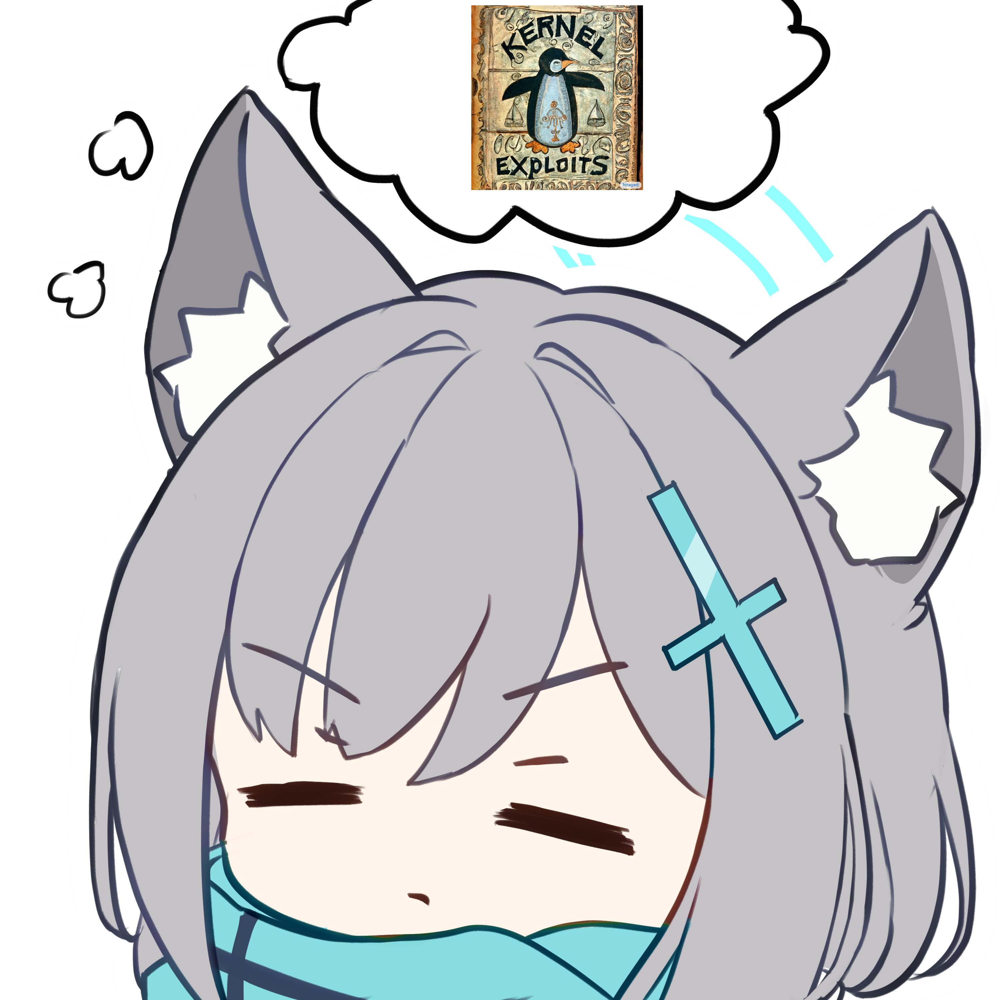

---
# the default layout is 'page'
icon: fas fa-info-circle
order: 4
spotify:
  size: 'small'
---


- name: Macron # name
  artist: Les Sales Majestés # music artist
  poster: https://t2.genius.com/unsafe/425x425/https%3A%2F%2Fimages.genius.com%2F1d824b9c1754c81a4550da5817854096.600x600x1.jpg
  src: /assets/audio/macron.ogg # music resource


>

# 💻 About me

A Pwner plays for [~~TheRoundTable~~](https://ctftime.org/team/194346) [Alternative für Knights](https://ctftime.org/team/369824).

I'm interested in `Binary Exploitation`. Now I'm focusing on `Linux kernel exploitation`. 

<figure>
  
</figure>

[How to start playing PWN](https://hackemall.live/index.php/2020/05/02/pwnable-roadmap/)

Writing detailed write-ups takes a lot of time, so I couldn't document all the challenges I’ve solved. If you want to know which CTF events I’ve participated in, check out these links:

https://ctftime.org/team/194346

https://ctftime.org/team/221828

https://ctftime.org/team/358599

https://github.com/robbert1978/CTF-2024

# 🏆 Achievements

No no, the greatest achievement is that you take time to read this blog.

# Image Credits

I would like to acknowledge and credit the creators of the images used on this website:

- **Background Image**: [Artwork on Pixiv](https://www.pixiv.net/en/artworks/109358771)
  
- **404 Page Image**: [Artwork on Pixiv](https://www.pixiv.net/en/artworks/111965557)
  
- **Top Image**: The original source is currently unknown due to multiple reuploads across various websites.

- **About image**: [Artwork on Pixiv](https://www.pixiv.net/en/artworks/114736658)

If you are the creator of any of these artworks and do not want your work displayed here, please contact me, and I will promptly remove it from my website.
